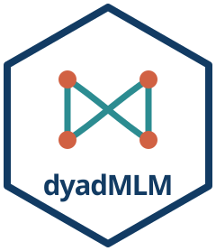

<!-- README.md is generated from README.Rmd. Please edit that file -->

```{r, include = FALSE}
knitr::opts_chunk$set(
  collapse = TRUE,
  comment = "#>",
  fig.path = "man/figures/README-",
  out.width = "100%"
)
```

# dyadMLM: Tools for Dyadic Multilevel Models 

<!-- badges: start -->
[](https://github.com/Pascal-Kueng/dyadMLM/actions/workflows/R-CMD-check.yaml)
[](https://app.codecov.io/gh/Pascal-Kueng/dyadMLM)
[](https://CRAN.R-project.org/package=dyadMLM)
[](https://CRAN.R-project.org/package=dyadMLM)
[](https://doi.org/10.5281/zenodo.22047083)
<!-- badges: end -->

`dyadMLM` provides tools for dyadic multilevel modeling with linear and
generalized linear mixed-effects models.

Developed by [Pascal Küng](https://pascalkueng.com/), Postdoctoral Researcher
at the [University of Zurich](https://www.psychology.uzh.ch/en/areas/sob/angsoz/team/kueng.html).
[OSF profile](https://osf.io/r2qdg/).

It provides supporting functions for:

1. [Data preparation and validation of dyadic data](#1-data-preparation-and-validation)
2. [Post-estimation tools](#2-post-estimation-tools)

## Installation

Install the stable release from CRAN:

```{r eval = FALSE}
install.packages("dyadMLM")
```

To try the latest changes and help test upcoming features, install the
development version from R-universe:

```{r eval = FALSE}
install.packages(
  "dyadMLM",
  repos = c(
    "https://pascal-kueng.r-universe.dev",
    "https://cloud.r-project.org"
  )
)
```

Development versions may change more frequently.

## Questions and contributing

Questions about using `dyadMLM`, specifying models, or interpreting output are
welcome in [Q&A Discussions](https://github.com/Pascal-Kueng/dyadMLM/discussions/categories/q-a).
Early feature or method ideas can start in
[Ideas](https://github.com/Pascal-Kueng/dyadMLM/discussions/categories/ideas),
while bugs and concrete improvements can be shared through
[Issues](https://github.com/Pascal-Kueng/dyadMLM/issues/new/choose).

Documentation, examples, tests, reviews, and code contributions are all
welcome; see the
[contribution guide](https://github.com/Pascal-Kueng/dyadMLM/blob/main/.github/CONTRIBUTING.md).
Please only share data you are permitted to make public. Never upload
identifiable or confidential research data.

## 1. Data preparation and validation

The core feature of this package is data preparation and validation for various
types of dyadic data. It creates model-ready columns for dyadic multilevel
models, including the Actor-Partner Interdependence Model (APIM),
Dyad-Individual Model (DIM), and the Dyadic Score Model (DSM).

The package currently supports:

- cross-sectional and intensive longitudinal dyadic data (e.g., daily diary data)
- distinguishable and exchangeable (indistinguishable) dyads
- datasets containing multiple dyad compositions (e.g., opposite-sex partners
  and same-sex partners)

See the [Getting Started vignette](https://pascal-kueng.github.io/dyadMLM/articles/getting-started.html).

## 2. Post-estimation tools

Selected post-estimation tools currently include:

- a function to compare compatible nested models
- a function to back-transform exchangeable random-effect covariance structures
  into interpretable member-level quantities, as described in the
  [APIM vignette](https://pascal-kueng.github.io/dyadMLM/articles/apim.html)

## Vignettes and examples

Start with the vignettes, or scroll down for a quick example.

| Vignette | Focus |
|---|---|
| [Getting Started](https://pascal-kueng.github.io/dyadMLM/articles/getting-started.html) | Data structure, validation, dyad compositions, generated columns, and basic preparation |
| [Actor-Partner Interdependence Model](https://pascal-kueng.github.io/dyadMLM/articles/apim.html) | APIM preparation and formulas for distinguishable and exchangeable dyads in cross-sectional and intensive longitudinal data |
| [Dyad-Individual Model](https://pascal-kueng.github.io/dyadMLM/articles/dim.html) | DIM predictor construction, formulas, and an interactive demonstration of APIM-DIM equivalence for exchangeable dyads |
| [Dyadic Score Model](https://pascal-kueng.github.io/dyadMLM/articles/dsm.html) | DSM predictor-score and contrast construction, formulas, and the relationship between the DSM and APIM for distinguishable dyads |

For theoretical foundations and a practical walkthrough of dyadic data analysis,
from data preparation and model fitting to interpretation and diagnostics using
`dyadMLM` with `glmmTMB`, see the
[Dyadic Data Analysis Workshop](https://pascal-kueng.github.io/dyadMLM/workshop/).
For a Bayesian workflow using `dyadMLM` and `brms`, refer to
[Distinguishable and Exchangeable Dyads: Bayesian Multilevel Modelling](https://pascal-kueng.github.io/05DyadicDataAnalysis/)
([source](https://github.com/Pascal-Kueng/05DyadicDataAnalysis),
[DOI](https://doi.org/10.5281/zenodo.17400655)).

### Simple Cross-Sectional Example

Prepare distinguishable dyads for a cross-sectional APIM:

```{r cross-sectional-prep}
library(dyadMLM)

prepared_data <- prepare_dyad_data(
  dyads_cross,
  dyad = coupleID,
  member = personID,
  role = gender,
  predictors = provided_support,
  model_types = "apim",
  # All three observed compositions in `dyads_cross` are detected and retained by
  # default. This example focuses on `female-male` dyads, so we restrict the
  # analysis here.
  keep_compositions = "female-male"
)

print(prepared_data, n = 4)
```

The prepared data contains the composition indicators and APIM actor/partner
predictor columns used in the model formulas below.

One simple distinguishable APIM formula is:

```{r cross-sectional-apim, eval = FALSE}
simple_apim <- glmmTMB::glmmTMB(
  closeness ~

    # Gender-specific intercepts
    0 + .is_female + .is_male +

    # Gender-specific actor effects
    .provided_support_actor:.is_female +
    .provided_support_actor:.is_male +

    # Gender-specific partner effects
    .provided_support_partner:.is_female +
    .provided_support_partner:.is_male +

    # Dyad-level random effects represent the two members'
    # residual covariance structure
    us(0 + .is_female + .is_male | coupleID),

  # With the residual covariance represented by the dyad-level
  # random effects above, the Gaussian residual dispersion is fixed near zero.
  dispformula = ~ 0,
  family = gaussian(),
  data = prepared_data
)
```

## Citation

If you use `dyadMLM`, please cite the installed package version. Run:

```{r eval = TRUE}
citation("dyadMLM")
```

---

**Continue** with the [Getting Started Vignette](https://pascal-kueng.github.io/dyadMLM/articles/getting-started.html).

Or go directly to a model-specific vignette:

- [Actor-Partner Interdependence Model (APIM) vignette](https://pascal-kueng.github.io/dyadMLM/articles/apim.html),
- [Dyad-Individual Model vignette](https://pascal-kueng.github.io/dyadMLM/articles/dim.html), or
- [Dyadic Score Model vignette](https://pascal-kueng.github.io/dyadMLM/articles/dsm.html).
