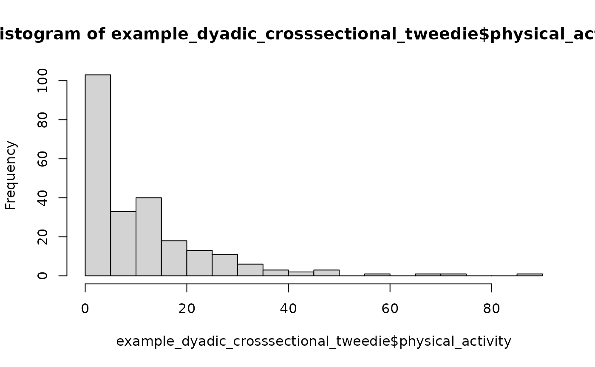
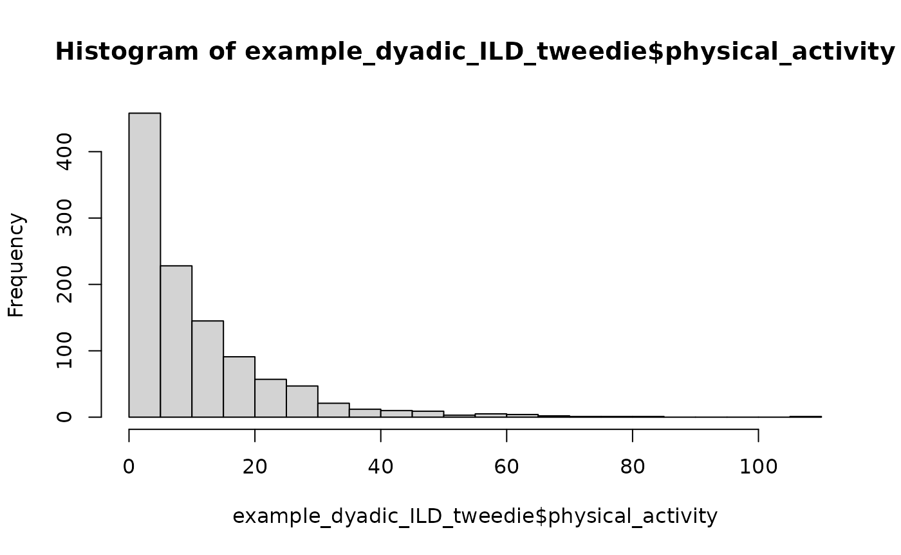

# Actor-Partner Interdependence Model (APIM)

``` r

library(interdep)
```

This vignette focuses on the cross-sectional and intensive longitudinal
Actor-Partner Interdependence model for distinguishable and exchangeable
dyads.

For the main data requirements and validation workflow of the `interdep`
package, start with the [Getting Started
vignette](https://pascal-kueng.github.io/interdep/articles/getting-started.md).
For APIMs that combine distinguishable and exchangeable dyad
compositions, see the [Mixed-Composition APIM
vignette](https://pascal-kueng.github.io/interdep/articles/mixed-apim.md).
For DIM predictors and their equivalence to APIM effects in exchangeable
dyads, see the [Dyad-Individual Model
vignette](https://pascal-kueng.github.io/interdep/articles/dim.md). For
DSM predictor scores and their relationship to APIM effects in
distinguishable dyads, see the [Dyadic Score Model
vignette](https://pascal-kueng.github.io/interdep/articles/dsm.md).

> This vignette is under construction and for now only contains a few
> preliminary example models. Please check back soon!

### Test distinguishability

Aside from using a Wald test on the first model, nested model
comparisons require models fit to the same prepared data object. Helpers
for creating those constrained columns are planned.

## Semi-continuous cross-sectional data

`example_dyadic_crosssectional_tweedie` has the same dyadic structure as
before, but the outcome has exact zeros and positive skewed values, as
in some physical activity outcomes, in contrast to the Gaussian
distribution from the previous example.

``` r

print(head(example_dyadic_crosssectional_tweedie))
#>   personID coupleID gender motivation physical_activity
#> 1        1        1 female -1.3379394          4.029024
#> 2        2        1   male -0.9379639          3.432234
#> 3        3        2 female -0.6370109          3.078311
#> 4        4        2   male  0.6999823         13.721497
#> 5        5        3 female -0.6078674          7.812779
#> 6        6        3   male -0.6459191          7.078761
hist(example_dyadic_crosssectional_tweedie$physical_activity, breaks = 20)
```



Validation and modeling work the same way because the dyadic structure
is the same. The random-effect interpretation is different from the
Gaussian case: Tweedie random effects are latent effects on the log-mean
scale, while the observation-level Tweedie variance remains part of the
model.

### Distinguishable Tweedie APIM

``` r

tweedie_distinguishable_data <- prepare_interdep_data(
  example_dyadic_crosssectional_tweedie,
  group = coupleID,
  member = personID,
  role = gender,
  predictors = motivation,
  # when no model_type is specified, apim is the default.
  seed = 123
)

print(tweedie_distinguishable_data)
#> # interdep data
#> # Rows: 240 | Dyads: 120 | Intensive longitudinal: no
#> # Structure: group = coupleID, member = personID, role = gender
#> #
#> # Dyad compositions:
#> # female_x_male distinguishable 120 dyads
#> #
#> # Added columns:
#> #   .i_composition       inferred dyad composition
#> #   .i_composition_role  composition-specific member role
#> #   .i_is_{comp-role}    composition-role indicator columns
#> #   .i_{pred}_actor      APIM actor predictor: actor's original predictor
#> #                        values
#> #   .i_{pred}_partner    APIM partner predictor: partner's original predictor
#> #                        values
#> #
#> # A tibble: 240 × 11
#>    personID coupleID gender motivation physical_activity .i_composition
#>       <int>    <int> <fct>       <dbl>             <dbl> <fct>         
#>  1        1        1 female    -1.34                4.03 female_x_male 
#>  2        2        1 male      -0.938               3.43 female_x_male 
#>  3        3        2 female    -0.637               3.08 female_x_male 
#>  4        4        2 male       0.700              13.7  female_x_male 
#>  5        5        3 female    -0.608               7.81 female_x_male 
#>  6        6        3 male      -0.646               7.08 female_x_male 
#>  7        7        4 female    -0.0316              1.45 female_x_male 
#>  8        8        4 male       0.380              23.3  female_x_male 
#>  9        9        5 female     0.575               3.98 female_x_male 
#> 10       10        5 male       1.77               20.1  female_x_male 
#> # ℹ 230 more rows
#> # ℹ 5 more variables: .i_composition_role <fct>,
#> #   .i_is_female_x_male_female <dbl>, .i_is_female_x_male_male <dbl>,
#> #   .i_motivation_actor <dbl>, .i_motivation_partner <dbl>
summary(tweedie_distinguishable_data)
#>     personID         coupleID         gender      motivation       
#>  Min.   :  1.00   Min.   :  1.00   female:120   Min.   :-2.320532  
#>  1st Qu.: 60.75   1st Qu.: 30.75   male  :120   1st Qu.:-0.580126  
#>  Median :120.50   Median : 60.50                Median :-0.032795  
#>  Mean   :120.50   Mean   : 60.50                Mean   :-0.008869  
#>  3rd Qu.:180.25   3rd Qu.: 90.25                3rd Qu.: 0.537262  
#>  Max.   :240.00   Max.   :120.00                Max.   : 2.423337  
#>                                                 NAs    :9          
#>  physical_activity       .i_composition           .i_composition_role
#>  Min.   : 0.000    female_x_male:240    female_x_male_female:120     
#>  1st Qu.: 1.445                         female_x_male_male  :120     
#>  Median : 7.855                                                      
#>  Mean   :11.026                                                      
#>  3rd Qu.:15.147                                                      
#>  Max.   :85.043                                                      
#>  NAs    :4                                                           
#>  .i_is_female_x_male_female .i_is_female_x_male_male .i_motivation_actor
#>  Min.   :0.0                Min.   :0.0              Min.   :-2.320532  
#>  1st Qu.:0.0                1st Qu.:0.0              1st Qu.:-0.580126  
#>  Median :0.5                Median :0.5              Median :-0.032795  
#>  Mean   :0.5                Mean   :0.5              Mean   :-0.008869  
#>  3rd Qu.:1.0                3rd Qu.:1.0              3rd Qu.: 0.537262  
#>  Max.   :1.0                Max.   :1.0              Max.   : 2.423337  
#>                                                      NAs    :9          
#>  .i_motivation_partner
#>  Min.   :-2.320532    
#>  1st Qu.:-0.580126    
#>  Median :-0.032795    
#>  Mean   :-0.008869    
#>  3rd Qu.: 0.537262    
#>  Max.   : 2.423337    
#>  NAs    :9
```

``` r


tweedie_distinguishable_model <- glmmTMB(
  physical_activity ~ 
    # remove standard intercept and model separate intercepts for male and female
    0 + .i_is_female_x_male_female + .i_is_female_x_male_male + 
    
    # gender-specific slopes for motivation actor effect
    .i_is_female_x_male_female:.i_motivation_actor + .i_is_female_x_male_male:.i_motivation_actor +
    
    # gender-specific slopes for motivation partner effect
    .i_is_female_x_male_female:.i_motivation_partner + .i_is_female_x_male_male:.i_motivation_partner +
    
    # keep a simple couple-level latent effect for stable non-independence
    # important limitation: this can only induce positive partner dependence
    (1 | coupleID) 
  
  # allow role-specific Tweedie dispersion
  , dispformula = ~ 0 + .i_is_female_x_male_female + .i_is_female_x_male_male
  , family = tweedie()
  , data = tweedie_distinguishable_data
)

summary(tweedie_distinguishable_model)
```

### Exchangeable Tweedie APIM

``` r

tweedie_exchangeable_data <- prepare_interdep_data(
  example_dyadic_crosssectional_tweedie,
  group = coupleID,
  member = personID,
  # role = gender,
  predictors = motivation,
  seed = 123
)

print(tweedie_exchangeable_data)
#> # interdep data
#> # Rows: 240 | Dyads: 120 | Intensive longitudinal: no
#> # Structure: group = coupleID, member = personID
#> #
#> # Dyad compositions:
#> # assumed_exchangeable exchangeable 120 dyads
#> #
#> # Added columns:
#> #   .i_composition       inferred dyad composition
#> #   .i_composition_role  composition-specific member role
#> #   .i_is_{comp-role}    composition-role indicator columns
#> #   .i_diff_{comp}       composition-specific sum-diff contrasts with arbitrary
#> #                        direction; 0 for distinguishable dyads or other
#> #                        exchangeable compositions
#> #   .i_{pred}_actor      APIM actor predictor: actor's original predictor
#> #                        values
#> #   .i_{pred}_partner    APIM partner predictor: partner's original predictor
#> #                        values
#> #
#> # A tibble: 240 × 11
#>    personID coupleID gender motivation physical_activity .i_composition      
#>       <int>    <int> <fct>       <dbl>             <dbl> <fct>               
#>  1        1        1 female    -1.34                4.03 assumed_exchangeable
#>  2        2        1 male      -0.938               3.43 assumed_exchangeable
#>  3        3        2 female    -0.637               3.08 assumed_exchangeable
#>  4        4        2 male       0.700              13.7  assumed_exchangeable
#>  5        5        3 female    -0.608               7.81 assumed_exchangeable
#>  6        6        3 male      -0.646               7.08 assumed_exchangeable
#>  7        7        4 female    -0.0316              1.45 assumed_exchangeable
#>  8        8        4 male       0.380              23.3  assumed_exchangeable
#>  9        9        5 female     0.575               3.98 assumed_exchangeable
#> 10       10        5 male       1.77               20.1  assumed_exchangeable
#> # ℹ 230 more rows
#> # ℹ 5 more variables: .i_composition_role <fct>,
#> #   .i_is_assumed_exchangeable <dbl>,
#> #   .i_diff_assumed_exchangeable_arbitrary <dbl>, .i_motivation_actor <dbl>,
#> #   .i_motivation_partner <dbl>
summary(tweedie_exchangeable_data)
#>     personID         coupleID         gender      motivation       
#>  Min.   :  1.00   Min.   :  1.00   female:120   Min.   :-2.320532  
#>  1st Qu.: 60.75   1st Qu.: 30.75   male  :120   1st Qu.:-0.580126  
#>  Median :120.50   Median : 60.50                Median :-0.032795  
#>  Mean   :120.50   Mean   : 60.50                Mean   :-0.008869  
#>  3rd Qu.:180.25   3rd Qu.: 90.25                3rd Qu.: 0.537262  
#>  Max.   :240.00   Max.   :120.00                Max.   : 2.423337  
#>                                                 NAs    :9          
#>  physical_activity              .i_composition           .i_composition_role
#>  Min.   : 0.000    assumed_exchangeable:240    assumed_exchangeable:240     
#>  1st Qu.: 1.445                                                             
#>  Median : 7.855                                                             
#>  Mean   :11.026                                                             
#>  3rd Qu.:15.147                                                             
#>  Max.   :85.043                                                             
#>  NAs    :4                                                                  
#>  .i_is_assumed_exchangeable .i_diff_assumed_exchangeable_arbitrary
#>  Min.   :1                  Min.   :-1                            
#>  1st Qu.:1                  1st Qu.:-1                            
#>  Median :1                  Median : 0                            
#>  Mean   :1                  Mean   : 0                            
#>  3rd Qu.:1                  3rd Qu.: 1                            
#>  Max.   :1                  Max.   : 1                            
#>                                                                   
#>  .i_motivation_actor .i_motivation_partner
#>  Min.   :-2.320532   Min.   :-2.320532    
#>  1st Qu.:-0.580126   1st Qu.:-0.580126    
#>  Median :-0.032795   Median :-0.032795    
#>  Mean   :-0.008869   Mean   :-0.008869    
#>  3rd Qu.: 0.537262   3rd Qu.: 0.537262    
#>  Max.   : 2.423337   Max.   : 2.423337    
#>  NAs    :9           NAs    :9
```

``` r


tweedie_exchangeable_model <- glmmTMB(
  physical_activity ~ 
    # pooled intercept 
    1 + 
    
    # pooled actor slope for motivation
    .i_motivation_actor +
    
    # pooled partner slope for motivation
    .i_motivation_partner +
    
    # exchangeable latent dyad block on the log-mean scale
    (1 | coupleID) + (0 + .i_diff_assumed_exchangeable_arbitrary | coupleID)
    
  # estimate a single pooled Tweedie dispersion parameter
  , dispformula = ~ 1
  , family = tweedie()
  , data = tweedie_exchangeable_data
)

summary(tweedie_exchangeable_model)
```

## ILD

Example model specification:

``` r


ild_distinguishable_model <- glmmTMB(
  closeness ~ 0 + 
    
    .i_is_female_x_male_female + 
    .i_is_female_x_male_male + 
    
    # Gender specific time trends
    .i_is_female_x_male_female:diaryday + 
    .i_is_female_x_male_male:diaryday +
    
    # Gender-specific within-person actor effects
    .i_is_female_x_male_female:.i_provided_support_cwp_actor +
    .i_is_female_x_male_male:.i_provided_support_cwp_actor +

    # Gender-specific within-person partner effects
    .i_is_female_x_male_female:.i_provided_support_cwp_partner +
    .i_is_female_x_male_male:.i_provided_support_cwp_partner +
    
    # Gender-specific between-person actor effects
    .i_is_female_x_male_female:.i_provided_support_cbp_actor +
    .i_is_female_x_male_male:.i_provided_support_cbp_actor +

    # Gender-specific between-person partner effects
    .i_is_female_x_male_female:.i_provided_support_cbp_partner +
    .i_is_female_x_male_male:.i_provided_support_cbp_partner +
    
    # random effects for stable non-independence (means)
    us(0 + 
         .i_is_female_x_male_female + 
         .i_is_female_x_male_male 
       | coupleID)  +

    # Same-day residual covariance
    us(0 + 
         .i_is_female_x_male_female + 
         .i_is_female_x_male_male 
       | coupleID:diaryday) 

  , dispformula = ~ 0  
  , family = gaussian()
  , data = ild_distinguishable_data
)

summary(ild_distinguishable_model)
```

## Semi-continuous intensive longitudinal dyadic data

`example_dyadic_ILD_tweedie` has the same intensive longitudinal dyadic
structure as `example_dyadic_ILD`, but the outcome is semi-continuous.

``` r

print(head(example_dyadic_ILD_tweedie, n = 26), n = 26)
#> # A tibble: 26 × 6
#>    personID coupleID diaryday gender physical_activity provided_support
#>       <int>    <int>    <int> <fct>              <dbl>            <dbl>
#>  1        1        1        0 female             4.29              4.73
#>  2        1        1        1 female             9.52              4.46
#>  3        1        1        2 female            10.5               3.79
#>  4        1        1        3 female             7.63              4.33
#>  5        1        1        4 female             6.77              4.61
#>  6        1        1        5 female            26.8               5.56
#>  7        1        1        6 female             0                 4.91
#>  8        1        1        7 female             0                 4.06
#>  9        1        1        8 female            10.2               4.53
#> 10        1        1        9 female             0                 3.72
#> 11        1        1       10 female             0.574             3.12
#> 12        1        1       11 female             2.84              3.60
#> 13        1        1       12 female            NA                NA   
#> 14        1        1       13 female             3.87              3.63
#> 15        2        1        0 male               3.73              6.63
#> 16        2        1        1 male              30.6               7.38
#> 17        2        1        2 male              21.5               5.38
#> 18        2        1        3 male               6.26              4.36
#> 19        2        1        4 male               9.22              6.08
#> 20        2        1        5 male              10.9               7.04
#> 21        2        1        6 male              NA                NA   
#> 22        2        1        7 male               0                 5.15
#> 23        2        1        8 male              10.3               2.66
#> 24        2        1        9 male              12.4               2.30
#> 25        2        1       10 male               3.80              4.03
#> 26        2        1       11 male               1.14              4.95
hist(example_dyadic_ILD_tweedie$physical_activity, breaks = 20)
```



### Distinguishable Tweedie ILD APIM

``` r

ild_tweedie_distinguishable_data <- prepare_interdep_data(
  example_dyadic_ILD_tweedie,
  group = coupleID,
  member = personID,
  role = gender,
  time = diaryday,
  predictors = provided_support,
  seed = 123
)

print(ild_tweedie_distinguishable_data)
#> # interdep data
#> # Rows: 1120 | Dyads: 40 | Intensive longitudinal: yes
#> # Structure: group = coupleID, member = personID, role = gender, time =
#> # diaryday
#> #
#> # Dyad compositions:
#> # female_x_male distinguishable 40 dyads
#> #
#> # Added columns:
#> #   .i_composition         inferred dyad composition
#> #   .i_composition_role    composition-specific member role
#> #   .i_is_{comp-role}      composition-role indicator columns
#> #   .i_{pred}_cwp          within-person predictor: momentary deviations from
#> #                          each person's usual level
#> #   .i_{pred}_cbp          between-person predictor: stable differences from
#> #                          the average person's usual level
#> #   .i_{pred}_actor        APIM actor predictor: actor's original predictor
#> #                          values
#> #   .i_{pred}_partner      APIM partner predictor: partner's original predictor
#> #                          values
#> #   .i_{pred}_cwp_actor    APIM within-person actor predictor: actor's
#> #                          momentary deviations from their usual level
#> #   .i_{pred}_cwp_partner  APIM within-person partner predictor: partner's
#> #                          momentary deviations from their usual level
#> #   .i_{pred}_cbp_actor    APIM between-person actor predictor: actor's stable
#> #                          difference from the average person's usual level
#> #   .i_{pred}_cbp_partner  APIM between-person partner predictor: partner's
#> #                          stable difference from the average person's usual
#> #                          level
#> #
#> # A tibble: 1,120 × 18
#>    personID coupleID diaryday gender physical_activity provided_support
#>       <int>    <int>    <int> <fct>              <dbl>            <dbl>
#>  1        1        1        0 female              4.29             4.73
#>  2        1        1        1 female              9.52             4.46
#>  3        1        1        2 female             10.5              3.79
#>  4        1        1        3 female              7.63             4.33
#>  5        1        1        4 female              6.77             4.61
#>  6        1        1        5 female             26.8              5.56
#>  7        1        1        6 female              0                4.91
#>  8        1        1        7 female              0                4.06
#>  9        1        1        8 female             10.2              4.53
#> 10        1        1        9 female              0                3.72
#> # ℹ 1,110 more rows
#> # ℹ 12 more variables: .i_composition <fct>, .i_composition_role <fct>,
#> #   .i_is_female_x_male_female <dbl>, .i_is_female_x_male_male <dbl>,
#> #   .i_provided_support_cwp <dbl>, .i_provided_support_cbp <dbl>,
#> #   .i_provided_support_actor <dbl>, .i_provided_support_partner <dbl>,
#> #   .i_provided_support_cwp_actor <dbl>, .i_provided_support_cwp_partner <dbl>,
#> #   .i_provided_support_cbp_actor <dbl>, …
summary(ild_tweedie_distinguishable_data)
#>     personID        coupleID        diaryday       gender    physical_activity
#>  Min.   : 1.00   Min.   : 1.00   Min.   : 0.0   female:560   Min.   :  0.000  
#>  1st Qu.:20.75   1st Qu.:10.75   1st Qu.: 3.0   male  :560   1st Qu.:  1.481  
#>  Median :40.50   Median :20.50   Median : 6.5                Median :  6.750  
#>  Mean   :40.50   Mean   :20.50   Mean   : 6.5                Mean   : 10.346  
#>  3rd Qu.:60.25   3rd Qu.:30.25   3rd Qu.:10.0                3rd Qu.: 14.635  
#>  Max.   :80.00   Max.   :40.00   Max.   :13.0                Max.   :108.626  
#>                                                              NAs    :24       
#>  provided_support       .i_composition           .i_composition_role
#>  Min.   :1.813    female_x_male:1120   female_x_male_female:560     
#>  1st Qu.:4.435                         female_x_male_male  :560     
#>  Median :5.070                                                      
#>  Mean   :5.111                                                      
#>  3rd Qu.:5.821                                                      
#>  Max.   :8.271                                                      
#>  NAs    :44                                                         
#>  .i_is_female_x_male_female .i_is_female_x_male_male .i_provided_support_cwp
#>  Min.   :0.0                Min.   :0.0              Min.   :-2.66098       
#>  1st Qu.:0.0                1st Qu.:0.0              1st Qu.:-0.50775       
#>  Median :0.5                Median :0.5              Median :-0.03176       
#>  Mean   :0.5                Mean   :0.5              Mean   : 0.00000       
#>  3rd Qu.:1.0                3rd Qu.:1.0              3rd Qu.: 0.52731       
#>  Max.   :1.0                Max.   :1.0              Max.   : 2.42077       
#>                                                      NAs    :44             
#>  .i_provided_support_cbp .i_provided_support_actor .i_provided_support_partner
#>  Min.   :-1.4073         Min.   :1.813             Min.   :1.813              
#>  1st Qu.:-0.4913         1st Qu.:4.435             1st Qu.:4.435              
#>  Median :-0.0164         Median :5.070             Median :5.070              
#>  Mean   : 0.0000         Mean   :5.111             Mean   :5.111              
#>  3rd Qu.: 0.4968         3rd Qu.:5.821             3rd Qu.:5.821              
#>  Max.   : 1.6645         Max.   :8.271             Max.   :8.271              
#>                          NAs    :44                NAs    :44                 
#>  .i_provided_support_cwp_actor .i_provided_support_cwp_partner
#>  Min.   :-2.66098              Min.   :-2.66098               
#>  1st Qu.:-0.50775              1st Qu.:-0.50775               
#>  Median :-0.03176              Median :-0.03176               
#>  Mean   : 0.00000              Mean   : 0.00000               
#>  3rd Qu.: 0.52731              3rd Qu.: 0.52731               
#>  Max.   : 2.42077              Max.   : 2.42077               
#>  NAs    :44                    NAs    :44                     
#>  .i_provided_support_cbp_actor .i_provided_support_cbp_partner
#>  Min.   :-1.4073               Min.   :-1.4073                
#>  1st Qu.:-0.4913               1st Qu.:-0.4913                
#>  Median :-0.0164               Median :-0.0164                
#>  Mean   : 0.0000               Mean   : 0.0000                
#>  3rd Qu.: 0.4968               3rd Qu.: 0.4968                
#>  Max.   : 1.6645               Max.   : 1.6645                
#> 
```

For Tweedie models, the random-effect blocks are latent effects on the
log-mean scale. They can induce partner dependence, but they are not
residual covariance structures in the same direct sense as in Gaussian
models, because the Tweedie observation-level variance remains part of
the model.

The first model uses role-specific stable couple effects and a simple
same-day shared latent shock. This is the easier teaching model: it
keeps role-specific Tweedie dispersion, but the same-day latent shock
can only induce positive partner dependence.

``` r


ild_tweedie_distinguishable_shared_day_model <- glmmTMB(
  physical_activity ~ 0 +

    .i_is_female_x_male_female + .i_is_female_x_male_male +

    .i_is_female_x_male_female:diaryday + .i_is_female_x_male_male:diaryday +

    # Gender-specific within-person actor effects
    .i_is_female_x_male_female:.i_provided_support_cwp_actor +
    .i_is_female_x_male_male:.i_provided_support_cwp_actor +

    # Gender-specific within-person partner effects
    .i_is_female_x_male_female:.i_provided_support_cwp_partner +
    .i_is_female_x_male_male:.i_provided_support_cwp_partner +

    # Gender-specific between-person actor effects
    .i_is_female_x_male_female:.i_provided_support_cbp_actor +
    .i_is_female_x_male_male:.i_provided_support_cbp_actor +

    # Gender-specific between-person partner effects
    .i_is_female_x_male_female:.i_provided_support_cbp_partner +
    .i_is_female_x_male_male:.i_provided_support_cbp_partner +

    # random effects for stable non-independence (means)
    (0 + .i_is_female_x_male_female + .i_is_female_x_male_male | coupleID) +

    # same-day shared latent shock; positive dependence only
    (1 | coupleID:diaryday)

  , dispformula = ~ 0 + .i_is_female_x_male_female + .i_is_female_x_male_male
  , family = tweedie()
  , data = ild_tweedie_distinguishable_data
)

summary(ild_tweedie_distinguishable_shared_day_model)
```

The second model uses a role-specific same-day latent covariance block.
This is closer to the Gaussian ILD covariance structure and can
represent positive or negative same-day partner dependence. In this ILD
example, the repeated paired occasions provide enough information to
also estimate role-specific Tweedie dispersion.

``` r


ild_tweedie_distinguishable_latent_day_cov_model <- glmmTMB(
  physical_activity ~ 0 +

    .i_is_female_x_male_female + .i_is_female_x_male_male +

    .i_is_female_x_male_female:diaryday + .i_is_female_x_male_male:diaryday +

    # Gender-specific within-person actor effects
    .i_is_female_x_male_female:.i_provided_support_cwp_actor +
    .i_is_female_x_male_male:.i_provided_support_cwp_actor +

    # Gender-specific within-person partner effects
    .i_is_female_x_male_female:.i_provided_support_cwp_partner +
    .i_is_female_x_male_male:.i_provided_support_cwp_partner +

    # Gender-specific between-person actor effects
    .i_is_female_x_male_female:.i_provided_support_cbp_actor +
    .i_is_female_x_male_male:.i_provided_support_cbp_actor +

    # Gender-specific between-person partner effects
    .i_is_female_x_male_female:.i_provided_support_cbp_partner +
    .i_is_female_x_male_male:.i_provided_support_cbp_partner +

    # random effects for stable non-independence (means)
    (0 + .i_is_female_x_male_female + .i_is_female_x_male_male | coupleID) +

    # same-day role-specific latent covariance; positive or negative dependence
    (0 + .i_is_female_x_male_female + .i_is_female_x_male_male | coupleID:diaryday)

  , dispformula = ~ 0 + .i_is_female_x_male_female + .i_is_female_x_male_male
  # in case of non-convergence, a first simplification could be to remove the
  # role-specific dispersion formula
  , family = tweedie()
  , data = ild_tweedie_distinguishable_data
)

summary(ild_tweedie_distinguishable_latent_day_cov_model)
```

The fuller same-day latent covariance structure is much more fragile in
the cross-sectional case because each dyad contributes only one paired
occasion. The same pair of observations must inform the fixed effects,
Tweedie dispersion and power, and the dyadic dependence structure. In
ILD data, each dyad contributes many paired occasions, so the stable
couple-level block and the same-day occasion-level block are informed by
repeated within-dyad patterns over time.

### Exchangeable Tweedie ILD APIM

``` r

ild_tweedie_exchangeable_data <- prepare_interdep_data(
  example_dyadic_ILD_tweedie,
  group = coupleID,
  member = personID,
  time = diaryday,
  predictors = provided_support,
  seed = 123
)

print(ild_tweedie_exchangeable_data)
#> # interdep data
#> # Rows: 1120 | Dyads: 40 | Intensive longitudinal: yes
#> # Structure: group = coupleID, member = personID, time = diaryday
#> #
#> # Dyad compositions:
#> # assumed_exchangeable exchangeable 40 dyads
#> #
#> # Added columns:
#> #   .i_composition         inferred dyad composition
#> #   .i_composition_role    composition-specific member role
#> #   .i_is_{comp-role}      composition-role indicator columns
#> #   .i_diff_{comp}         composition-specific sum-diff contrasts with
#> #                          arbitrary direction; 0 for distinguishable dyads or
#> #                          other exchangeable compositions
#> #   .i_{pred}_cwp          within-person predictor: momentary deviations from
#> #                          each person's usual level
#> #   .i_{pred}_cbp          between-person predictor: stable differences from
#> #                          the average person's usual level
#> #   .i_{pred}_actor        APIM actor predictor: actor's original predictor
#> #                          values
#> #   .i_{pred}_partner      APIM partner predictor: partner's original predictor
#> #                          values
#> #   .i_{pred}_cwp_actor    APIM within-person actor predictor: actor's
#> #                          momentary deviations from their usual level
#> #   .i_{pred}_cwp_partner  APIM within-person partner predictor: partner's
#> #                          momentary deviations from their usual level
#> #   .i_{pred}_cbp_actor    APIM between-person actor predictor: actor's stable
#> #                          difference from the average person's usual level
#> #   .i_{pred}_cbp_partner  APIM between-person partner predictor: partner's
#> #                          stable difference from the average person's usual
#> #                          level
#> #
#> # A tibble: 1,120 × 18
#>    personID coupleID diaryday gender physical_activity provided_support
#>       <int>    <int>    <int> <fct>              <dbl>            <dbl>
#>  1        1        1        0 female              4.29             4.73
#>  2        1        1        1 female              9.52             4.46
#>  3        1        1        2 female             10.5              3.79
#>  4        1        1        3 female              7.63             4.33
#>  5        1        1        4 female              6.77             4.61
#>  6        1        1        5 female             26.8              5.56
#>  7        1        1        6 female              0                4.91
#>  8        1        1        7 female              0                4.06
#>  9        1        1        8 female             10.2              4.53
#> 10        1        1        9 female              0                3.72
#> # ℹ 1,110 more rows
#> # ℹ 12 more variables: .i_composition <fct>, .i_composition_role <fct>,
#> #   .i_is_assumed_exchangeable <dbl>,
#> #   .i_diff_assumed_exchangeable_arbitrary <dbl>,
#> #   .i_provided_support_cwp <dbl>, .i_provided_support_cbp <dbl>,
#> #   .i_provided_support_actor <dbl>, .i_provided_support_partner <dbl>,
#> #   .i_provided_support_cwp_actor <dbl>, …
summary(ild_tweedie_exchangeable_data)
#>     personID        coupleID        diaryday       gender    physical_activity
#>  Min.   : 1.00   Min.   : 1.00   Min.   : 0.0   female:560   Min.   :  0.000  
#>  1st Qu.:20.75   1st Qu.:10.75   1st Qu.: 3.0   male  :560   1st Qu.:  1.481  
#>  Median :40.50   Median :20.50   Median : 6.5                Median :  6.750  
#>  Mean   :40.50   Mean   :20.50   Mean   : 6.5                Mean   : 10.346  
#>  3rd Qu.:60.25   3rd Qu.:30.25   3rd Qu.:10.0                3rd Qu.: 14.635  
#>  Max.   :80.00   Max.   :40.00   Max.   :13.0                Max.   :108.626  
#>                                                              NAs    :24       
#>  provided_support              .i_composition           .i_composition_role
#>  Min.   :1.813    assumed_exchangeable:1120   assumed_exchangeable:1120    
#>  1st Qu.:4.435                                                             
#>  Median :5.070                                                             
#>  Mean   :5.111                                                             
#>  3rd Qu.:5.821                                                             
#>  Max.   :8.271                                                             
#>  NAs    :44                                                                
#>  .i_is_assumed_exchangeable .i_diff_assumed_exchangeable_arbitrary
#>  Min.   :1                  Min.   :-1                            
#>  1st Qu.:1                  1st Qu.:-1                            
#>  Median :1                  Median : 0                            
#>  Mean   :1                  Mean   : 0                            
#>  3rd Qu.:1                  3rd Qu.: 1                            
#>  Max.   :1                  Max.   : 1                            
#>                                                                   
#>  .i_provided_support_cwp .i_provided_support_cbp .i_provided_support_actor
#>  Min.   :-2.66098        Min.   :-1.4073         Min.   :1.813            
#>  1st Qu.:-0.50775        1st Qu.:-0.4913         1st Qu.:4.435            
#>  Median :-0.03176        Median :-0.0164         Median :5.070            
#>  Mean   : 0.00000        Mean   : 0.0000         Mean   :5.111            
#>  3rd Qu.: 0.52731        3rd Qu.: 0.4968         3rd Qu.:5.821            
#>  Max.   : 2.42077        Max.   : 1.6645         Max.   :8.271            
#>  NAs    :44                                      NAs    :44               
#>  .i_provided_support_partner .i_provided_support_cwp_actor
#>  Min.   :1.813               Min.   :-2.66098             
#>  1st Qu.:4.435               1st Qu.:-0.50775             
#>  Median :5.070               Median :-0.03176             
#>  Mean   :5.111               Mean   : 0.00000             
#>  3rd Qu.:5.821               3rd Qu.: 0.52731             
#>  Max.   :8.271               Max.   : 2.42077             
#>  NAs    :44                  NAs    :44                   
#>  .i_provided_support_cwp_partner .i_provided_support_cbp_actor
#>  Min.   :-2.66098                Min.   :-1.4073              
#>  1st Qu.:-0.50775                1st Qu.:-0.4913              
#>  Median :-0.03176                Median :-0.0164              
#>  Mean   : 0.00000                Mean   : 0.0000              
#>  3rd Qu.: 0.52731                3rd Qu.: 0.4968              
#>  Max.   : 2.42077                Max.   : 1.6645              
#>  NAs    :44                                                   
#>  .i_provided_support_cbp_partner
#>  Min.   :-1.4073                
#>  1st Qu.:-0.4913                
#>  Median :-0.0164                
#>  Mean   : 0.0000                
#>  3rd Qu.: 0.4968                
#>  Max.   : 1.6645                
#> 
```

This is the exchangeable analogue of the fuller Tweedie ILD model above.
The sum-diff random-effect blocks provide stable and same-day
exchangeable latent covariance structures. The Tweedie dispersion stays
pooled because the sum-diff signs identify exchangeable positions, not
substantive roles.

``` r


ild_tweedie_exchangeable_model <- glmmTMB(
  physical_activity ~
    1 +

    diaryday +

    # Pooled within-person actor and partner effects
    .i_provided_support_cwp_actor +
    .i_provided_support_cwp_partner +

    # Pooled between-person actor and partner effects
    .i_provided_support_cbp_actor +
    .i_provided_support_cbp_partner +

    # stable exchangeable latent covariance
    (1 | coupleID) + (0 + .i_diff_assumed_exchangeable_arbitrary | coupleID) +
  
    # same-day exchangeable latent covariance
    (1 | coupleID:diaryday) + (0 + .i_diff_assumed_exchangeable_arbitrary | coupleID:diaryday)

  # pooled dispersion; exchangeable positions should not define dispersion differences
  , dispformula = ~ 1
  , family = tweedie()
  , data = ild_tweedie_exchangeable_data
)

summary(ild_tweedie_exchangeable_model)
```

------------------------------------------------------------------------

**Continue** with the [Mixed-Composition APIM
vignette](https://pascal-kueng.github.io/interdep/articles/mixed-apim.md),

refer to the:

- [Dyad-Individual Model
  vignette](https://pascal-kueng.github.io/interdep/articles/dim.md),
- [Dyadic Score Model
  vignette](https://pascal-kueng.github.io/interdep/articles/dsm.md),

or return to the
[Overview](https://pascal-kueng.github.io/interdep/articles/index.md).
