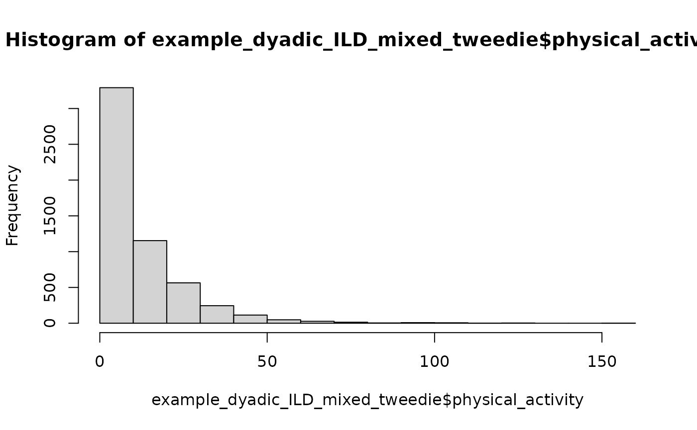

# Getting Started

``` r

library(interdep)
has_glmmTMB <- requireNamespace("glmmTMB", quietly = TRUE)
```

`interdep` helps researchers prepare cross-sectional and intensive
longitudinal dyadic data for multilevel models, including generalized
multilevel models. It supports common dyadic studies with one kind of
dyad, and it also handles studies where different kinds of dyads appear
in the same dataset, such as female-male, female-female, and male-male
couples. It creates composition-aware, model-ready columns for dyadic
multilevel model parameterizations such as APIM, DIM, and undirected
DSM. Current DIM and undirected DSM helpers require one exchangeable
dyad composition.

This vignette focuses mainly on APIM-style actor and partner effects in
multilevel model formulas, especially models with multiple dyad types,
intensive longitudinal data, and generalized outcomes. For the
Dyad-Individual Model (DIM) parameterization, including dyad-mean and
within-dyad-deviation predictors and their equivalence to APIM effects
in exchangeable dyads, see the [Dyad-Individual Model
vignette](https://pascal-kueng.github.io/interdep/articles/Dyad-Individual-Model.md).

The basic data structure is a long data frame where dyads are stacked on
top of each other and both members of a dyad appear as separate rows.
For cross-sectional data, each complete dyad contributes one row per
member. For intensive longitudinal data, each observed member-occasion
has at most one row. Dyads must contain two unique members overall, but
member-occasion rows may be absent.

The expected structure is:

- cross-sectional: one row per `dyad x member`

| dyad | member |   x |   y |
|-----:|-------:|----:|----:|
|    1 |      1 | 4.2 | 7.1 |
|    1 |      2 | 5.0 | 6.4 |
|    2 |      1 | 3.8 | 5.9 |
|    2 |      2 | 4.5 | 6.8 |

- intensive longitudinal: at most one row per `dyad x time x member`

| dyad | time | member |   x |   y |
|-----:|-----:|-------:|----:|----:|
|    1 |    1 |      1 | 4.2 | 7.1 |
|    1 |    1 |      2 | 5.0 | 6.4 |
|    1 |    2 |      1 | 4.0 | 6.9 |
|    1 |    2 |      2 | 5.3 | 6.6 |

Measured variables may contain missing values. The structural `group`,
`member`, and optional `time` variables must be complete. Missing or
incomplete role and dyad information can be handled with the function
arguments `missing_role` and `incomplete_dyads`.

In intensive longitudinal data, missing measurement occasions can be
represented by absent rows, as long as the time variable preserves the
observed measurement occasions. For example:

| dyad | personID | time |   x |   y |
|-----:|---------:|-----:|----:|----:|
|    1 |        1 |    1 | 4.2 | 7.1 |
|    1 |        1 |    3 | 4.0 | 6.9 |
|    1 |        2 |    1 | 5.3 | 6.6 |
|    1 |        2 |    2 | 4.7 | 6.1 |
|    1 |        2 |    3 | 5.1 | 6.4 |

*Note* that the row for person 1 at time 2 is absent. The time variable
still uses the observed measurement occasions and skips from time 1 to
time 3 for that person, which is fine.

[`prepare_interdep_data()`](https://pascal-kueng.github.io/interdep/reference/prepare_interdep_data.md)
validates the expected structure, returns a tibble with class
`interdep_data`, and adds the dyad-composition labels and model-ready
columns needed for dyadic multilevel model formulas.

Omit `role` only when all partners should be treated as exchangeable.

The examples build up from simple dyadic structures to composition-aware
models:

- distinguishable dyads, where member roles are modeled separately;
- exchangeable dyads, where arbitrary member labels are handled with
  sum-diff columns;
- semi-continuous and intensive longitudinal outcomes;
- mixed-composition dyadic MLMs that combine distinguishable and
  exchangeable dyads in one model, illustrated in the [mixed-composition
  cross-sectional](#mixed-cross-sectional-gaussian-model) and
  [mixed-composition intensive
  longitudinal](#mixed-intensive-longitudinal-gaussian-model) examples.

## Cross-sectional dyadic data

`example_dyadic_crosssectional` is a simulated cross-sectional dataset
for distinguishable dyads. Each dyad has two rows: one for each member.

``` r

print(example_dyadic_crosssectional)
#>     personID coupleID gender communication satisfaction
#> 1          1        1 female      4.789772  4.367823504
#> 2          2        1   male      3.803445  2.342889769
#> 3          3        2 female      2.914052  2.442250410
#> 4          4        2   male      6.508207  6.080427515
#> 5          5        3 female      5.696995  5.865493986
#> 6          6        3   male      8.215332  9.661294814
#> 7          7        4 female      5.282135  6.504795827
#> 8          8        4   male      4.894840  3.077529011
#> 9          9        5 female      6.005546  7.405502029
#> 10        10        5   male      4.318964  1.466224949
#> 11        11        6 female      7.736048  7.850461607
#> 12        12        6   male      6.568731  9.843615276
#> 13        13        7 female      5.367394  4.816046949
#> 14        14        7   male      5.789497  6.154543265
#> 15        15        8 female      3.615039  2.332304961
#> 16        16        8   male      3.209683 -1.347301064
#> 17        17        9 female      4.423542  4.959867673
#> 18        18        9   male      3.852471  1.561731428
#> 19        19       10 female      5.222533  4.227248634
#> 20        20       10   male      3.658864 -0.496317369
#> 21        21       11 female      6.573205  6.830698453
#> 22        22       11   male      6.499216 10.225986814
#> 23        23       12 female      6.096428  4.505799320
#> 24        24       12   male      4.806698  5.132349125
#> 25        25       13 female      6.873318  9.438638109
#> 26        26       13   male      4.132610  3.348089952
#> 27        27       14 female      5.451294  5.626019319
#> 28        28       14   male      4.826518  4.803324228
#> 29        29       15 female      3.547392  2.153043010
#> 30        30       15   male      5.057458  3.036044194
#> 31        31       16 female      7.715254 11.139927942
#> 32        32       16   male      6.769862  7.710172741
#> 33        33       17 female      5.125304  7.034283314
#> 34        34       17   male      6.124291  5.629795996
#> 35        35       18 female      3.861141  3.578931914
#> 36        36       18   male      1.202689 -3.143820558
#> 37        37       19 female      5.925843  6.948752225
#> 38        38       19   male      5.834546  8.648570426
#> 39        39       20 female      3.979915  4.064585316
#> 40        40       20   male      4.833388  3.921308434
#> 41        41       21 female      3.412469  2.078650835
#> 42        42       21   male      3.907315  2.043147568
#> 43        43       22 female      4.639622  6.341714809
#> 44        44       22   male      4.813266  5.088600564
#> 45        45       23 female      4.238768  2.584634760
#> 46        46       23   male      3.185981  2.444970497
#> 47        47       24 female      4.783352  3.705960849
#> 48        48       24   male      3.387145  0.146737642
#> 49        49       25 female      5.056990  3.722934920
#> 50        50       25   male      3.374174 -0.799642829
#> 51        51       26 female      2.786560 -1.060537254
#> 52        52       26   male      2.979873  1.908371262
#> 53        53       27 female      6.829844  7.929636647
#> 54        54       27   male      5.272985  4.255706439
#> 55        55       28 female      5.595516  8.219533319
#> 56        56       28   male      4.789448  3.825206058
#> 57        57       29 female      3.782051  4.204577721
#> 58        58       29   male      3.361248 -0.273768569
#> 59        59       30 female      5.058638  7.471934331
#> 60        60       30   male      8.088412  8.319142745
#> 61        61       31 female      6.070840  6.765360862
#> 62        62       31   male      4.999577  3.457514211
#> 63        63       32 female      4.436298  4.067283971
#> 64        64       32   male      4.823078  4.748019829
#> 65        65       33 female      6.059322  7.796860318
#> 66        66       33   male      6.187425  8.677392717
#> 67        67       34 female      6.892295  6.478572783
#> 68        68       34   male      5.311803  5.472506584
#> 69        69       35 female      6.089662  6.767098703
#> 70        70       35   male      5.972491  5.403948673
#> 71        71       36 female      4.677417  5.167676128
#> 72        72       36   male            NA           NA
#> 73        73       37 female      5.324213  5.511400988
#> 74        74       37   male      6.066110  4.833669328
#> 75        75       38 female      4.888425  6.785997404
#> 76        76       38   male      4.956178  3.825718383
#> 77        77       39 female      4.963136  3.886140007
#> 78        78       39   male            NA           NA
#> 79        79       40 female      6.209427  7.719978841
#> 80        80       40   male            NA -0.473915521
#> 81        81       41 female      3.198661  0.599274713
#> 82        82       41   male      5.057638  6.367633378
#> 83        83       42 female      5.939104  6.495960386
#> 84        84       42   male      3.539028  1.773911784
#> 85        85       43 female      2.804011  0.807297015
#> 86        86       43   male      4.019869  2.121972094
#> 87        87       44 female      6.153529  7.721701982
#> 88        88       44   male      9.290507 10.707985374
#> 89        89       45 female      7.702260 10.100353251
#> 90        90       45   male      5.329701  4.675337228
#> 91        91       46 female      3.013935  1.814215654
#> 92        92       46   male      4.167085  0.222797733
#> 93        93       47 female      4.709801  5.822773158
#> 94        94       47   male      4.278966  3.218920005
#> 95        95       48 female      5.706000  6.268325207
#> 96        96       48   male      3.122704  1.939523986
#> 97        97       49 female      7.223275  7.226680639
#> 98        98       49   male      4.734422  4.059173932
#> 99        99       50 female      6.211169  6.988629842
#> 100      100       50   male      3.579576  0.792422500
#> 101      101       51 female      5.754096  8.834953373
#> 102      102       51   male      4.881728  4.074893958
#> 103      103       52 female      6.165129  8.357017641
#> 104      104       52   male      3.763219  2.231169198
#> 105      105       53 female      4.381017  3.713286063
#> 106      106       53   male      5.511379  7.187094370
#> 107      107       54 female      4.992167  6.284405518
#> 108      108       54   male      8.442998  8.619585095
#> 109      109       55 female      5.774063  6.361182554
#> 110      110       55   male      3.659256  1.856600099
#> 111      111       56 female      6.255962  6.325875198
#> 112      112       56   male      7.550349 11.420893949
#> 113      113       57 female      2.424498  0.007995176
#> 114      114       57   male      3.688163  0.888919209
#> 115      115       58 female      5.460752  5.721141671
#> 116      116       58   male      6.006617  3.686647901
#> 117      117       59 female      5.983902  7.063771871
#> 118      118       59   male            NA  2.385423043
#> 119      119       60 female      5.369145  5.700683635
#> 120      120       60   male      5.172864  5.364573711
#> 121      121       61 female      5.706812  8.337808646
#> 122      122       61   male      5.246075  5.143913698
#> 123      123       62 female      3.907046  3.788120627
#> 124      124       62   male      4.832132  2.997973577
#> 125      125       63 female      4.887818  5.655001331
#> 126      126       63   male      4.275838  2.770493976
#> 127      127       64 female      2.919032  2.664957087
#> 128      128       64   male      4.524364  3.575223473
#> 129      129       65 female            NA  2.310860068
#> 130      130       65   male      3.347163  3.335469621
#> 131      131       66 female      4.516035  4.063622655
#> 132      132       66   male      6.245816  5.903612370
#> 133      133       67 female      6.424486  8.612924725
#> 134      134       67   male      4.700512  6.349328226
#> 135      135       68 female      6.101843  6.775381703
#> 136      136       68   male            NA  3.810355895
#> 137      137       69 female      3.494650  4.024588678
#> 138      138       69   male      8.820223 10.684163023
#> 139      139       70 female      7.915319 12.428895035
#> 140      140       70   male      7.230352  7.246656265
#> 141      141       71 female      4.138742  3.861234337
#> 142      142       71   male      4.628780  2.632253144
#> 143      143       72 female      1.579021 -0.924929711
#> 144      144       72   male            NA           NA
#> 145      145       73 female      6.659658  8.234316722
#> 146      146       73   male      5.864725  6.275647842
#> 147      147       74 female      3.685315  4.466212331
#> 148      148       74   male      4.534606  5.997754978
#> 149      149       75 female      3.833421 -0.480661413
#> 150      150       75   male      4.439691  5.024939471
#> 151      151       76 female      6.464035  7.197089500
#> 152      152       76   male      6.110129  8.752058089
#> 153      153       77 female      4.588969  4.070509337
#> 154      154       77   male      4.696256  3.225180345
#> 155      155       78 female      3.496001  3.314580268
#> 156      156       78   male      3.440022 -1.257165917
#> 157      157       79 female      3.478832  2.805085256
#> 158      158       79   male      6.976236  6.606569856
#> 159      159       80 female      5.434762  4.989182790
#> 160      160       80   male      4.216623  2.756189338
#> 161      161       81 female      5.907687  6.156012563
#> 162      162       81   male      4.106781  4.100143004
#> 163      163       82 female      5.452477  5.247245249
#> 164      164       82   male      5.514569  6.448223654
#> 165      165       83 female      4.279739  4.519059807
#> 166      166       83   male      4.789911  5.104683292
#> 167      167       84 female      5.450046  6.506046858
#> 168      168       84   male      6.167327  4.274859999
#> 169      169       85 female      5.099877  5.158246028
#> 170      170       85   male      4.346706  4.484107737
#> 171      171       86 female      6.289995  5.359077466
#> 172      172       86   male      4.542771  2.115966897
#> 173      173       87 female      5.338710  7.958085014
#> 174      174       87   male      7.414335  9.663146057
#> 175      175       88 female      5.833416  7.100300708
#> 176      176       88   male      5.258881  5.240773867
#> 177      177       89 female      5.302050  4.453682655
#> 178      178       89   male      3.879868  2.572026868
#> 179      179       90 female      6.635866  7.837465211
#> 180      180       90   male      6.247619  6.697747891
#> 181      181       91 female      6.408834  9.487468461
#> 182      182       91   male      6.084841  4.574105828
#> 183      183       92 female      4.776340  5.869699834
#> 184      184       92   male      6.600125  8.553933084
#> 185      185       93 female      5.229987  5.423592004
#> 186      186       93   male      5.369225  5.473593412
#> 187      187       94 female      3.592466  3.198612904
#> 188      188       94   male      4.831503  3.377416256
#> 189      189       95 female      7.117816 10.630615056
#> 190      190       95   male      6.297395  7.992516814
```

We validate and prepare the data with the function
[`prepare_interdep_data()`](https://pascal-kueng.github.io/interdep/reference/prepare_interdep_data.md)

``` r

cross_distinguishable_data <- prepare_interdep_data(
  example_dyadic_crosssectional,
  group = coupleID,
  member = personID,
  role = gender,
  
  # if we specify a predictor and a model type, we get transformed variables. 
  # here, .i_communication_raw_actor and .i_communication_raw_partner
  predictors = communication,
  model_type = "apim",
  seed = 123
)

# We can inspect all attributes with this call
attr(cross_distinguishable_data, "interdep")
#> $group
#> [1] "coupleID"
#> 
#> $member
#> [1] "personID"
#> 
#> $role
#> [1] "gender"
#> 
#> $time
#> NULL
#> 
#> $predictors
#> [1] "communication"
#> 
#> $outcomes
#> NULL
#> 
#> $n_dyads
#> [1] 95
#> 
#> $longitudinal
#> [1] FALSE
#> 
#> $temporal_predictor_decomposition
#> [1] "none"
#> 
#> $model_type
#> [1] "apim"
#> 
#> $dropped_missing_role_dyads
#> integer(0)
#> 
#> $dropped_incomplete_dyads
#> integer(0)
#> 
#> $dyad_compositions
#> # A tibble: 1 × 5
#>   composition   dyad_type       dyad_type_source pooled_from n_dyads
#>   <chr>         <chr>           <chr>            <chr>         <int>
#> 1 female_x_male distinguishable inferred         NA               95
#> 
#> $temporal_predictor_decompositions
#> # A tibble: 1 × 4
#>   predictor     component column        temporal_predictor_decomposition
#>   <chr>         <chr>     <chr>         <chr>                           
#> 1 communication raw       communication none                            
#> 
#> $apim_predictors
#> # A tibble: 1 × 5
#>   predictor     component source_column actor_column              partner_column
#>   <chr>         <chr>     <chr>         <chr>                     <chr>         
#> 1 communication raw       communication .i_communication_raw_act… .i_communicat…

print(cross_distinguishable_data, n = 20)
#> # interdep data
#> # Rows: 190 | Dyads: 95 | Intensive longitudinal: no
#> # Structure: group = coupleID, member = personID, role = gender
#> #
#> # Dyad compositions:
#> # female_x_male distinguishable 95 dyads
#> #
#> # Added columns:
#> #   .i_composition       inferred dyad composition
#> #   .i_composition_role  composition-specific member role
#> #   .i_is_*              composition-role indicator columns
#> #   .i_*_raw_actor       APIM actor predictor: actor's original predictor
#> #                        values
#> #   .i_*_raw_partner     APIM partner predictor: partner's original predictor
#> #                        values
#> #
#> # A tibble: 190 × 11
#>    personID coupleID gender communication satisfaction .i_composition
#>       <int>    <int> <chr>          <dbl>        <dbl> <fct>         
#>  1        1        1 female          4.79        4.37  female_x_male 
#>  2        2        1 male            3.80        2.34  female_x_male 
#>  3        3        2 female          2.91        2.44  female_x_male 
#>  4        4        2 male            6.51        6.08  female_x_male 
#>  5        5        3 female          5.70        5.87  female_x_male 
#>  6        6        3 male            8.22        9.66  female_x_male 
#>  7        7        4 female          5.28        6.50  female_x_male 
#>  8        8        4 male            4.89        3.08  female_x_male 
#>  9        9        5 female          6.01        7.41  female_x_male 
#> 10       10        5 male            4.32        1.47  female_x_male 
#> 11       11        6 female          7.74        7.85  female_x_male 
#> 12       12        6 male            6.57        9.84  female_x_male 
#> 13       13        7 female          5.37        4.82  female_x_male 
#> 14       14        7 male            5.79        6.15  female_x_male 
#> 15       15        8 female          3.62        2.33  female_x_male 
#> 16       16        8 male            3.21       -1.35  female_x_male 
#> 17       17        9 female          4.42        4.96  female_x_male 
#> 18       18        9 male            3.85        1.56  female_x_male 
#> 19       19       10 female          5.22        4.23  female_x_male 
#> 20       20       10 male            3.66       -0.496 female_x_male 
#> # ℹ 170 more rows
#> # ℹ 5 more variables: .i_composition_role <fct>,
#> #   .i_is_female_x_male_female <dbl>, .i_is_female_x_male_male <dbl>,
#> #   .i_communication_raw_actor <dbl>, .i_communication_raw_partner <dbl>
summary(cross_distinguishable_data)
#>     personID         coupleID           gender    communication  
#>  Min.   :  1.00   Min.   : 1.00   Length   :190   Min.   :1.203  
#>  1st Qu.: 48.25   1st Qu.:24.25   N.unique :  2   1st Qu.:4.192  
#>  Median : 95.50   Median :48.00   N.blank  :  0   Median :5.058  
#>  Mean   : 95.50   Mean   :48.00   Min.nchar:  4   Mean   :5.131  
#>  3rd Qu.:142.75   3rd Qu.:71.75   Max.nchar:  6   3rd Qu.:6.078  
#>  Max.   :190.00   Max.   :95.00                   Max.   :9.291  
#>                                                   NAs    :7      
#>   satisfaction          .i_composition           .i_composition_role
#>  Min.   :-3.144   female_x_male:190    female_x_male_female:95      
#>  1st Qu.: 3.209                        female_x_male_male  :95      
#>  Median : 5.025                                                     
#>  Mean   : 4.964                                                     
#>  3rd Qu.: 6.781                                                     
#>  Max.   :12.429                                                     
#>  NAs    :3                                                          
#>  .i_is_female_x_male_female .i_is_female_x_male_male .i_communication_raw_actor
#>  Min.   :0.0                Min.   :0.0              Min.   :1.203             
#>  1st Qu.:0.0                1st Qu.:0.0              1st Qu.:4.192             
#>  Median :0.5                Median :0.5              Median :5.058             
#>  Mean   :0.5                Mean   :0.5              Mean   :5.131             
#>  3rd Qu.:1.0                3rd Qu.:1.0              3rd Qu.:6.078             
#>  Max.   :1.0                Max.   :1.0              Max.   :9.291             
#>                                                      NAs    :7                 
#>  .i_communication_raw_partner
#>  Min.   :1.203               
#>  1st Qu.:4.192               
#>  Median :5.058               
#>  Mean   :5.131               
#>  3rd Qu.:6.078               
#>  Max.   :9.291               
#>  NAs    :7
```

The generated `.i_*` columns can be used directly in model formulas.

### Distinguishable Gaussian APIM

``` r

library(glmmTMB)

cross_distinguishable_model <- glmmTMB(
  satisfaction ~ 
    # remove standard intercept and model separate intercepts for male and female
    0 + .i_is_female_x_male_female + .i_is_female_x_male_male + 
    
    # gender-specific slopes for communication actor effect (no main effect)
    .i_is_female_x_male_female:.i_communication_raw_actor + .i_is_female_x_male_male:.i_communication_raw_actor +
    
    # gender-specific slopes for communication partner effect (no main effect)
    .i_is_female_x_male_female:.i_communication_raw_partner + .i_is_female_x_male_male:.i_communication_raw_partner +
    
    # residual covariance in glmmTMB can be modeled with random intercepts
    # when dispformula ~ 0. We model gender-specific residual variances and 
    # a correlation between the partners' residuals. 
    us(0 + .i_is_female_x_male_female + .i_is_female_x_male_male | coupleID)
  
  , dispformula = ~ 0 
  , family = gaussian()
  , data = cross_distinguishable_data
)

summary(cross_distinguishable_model)
```

### Exchangeable Gaussian APIM

We can treat all dyads as exchangeable by omitting the `role` argument.
The prepared data contains a composition indicator and a sum-diff
contrast for the assumed exchangeable dyads.

``` r

cross_exchangeable_data <- prepare_interdep_data(
  example_dyadic_crosssectional,
  group = coupleID,
  member = personID,
  predictors = communication,
  model_type = "apim",
  seed = 123
)

print(cross_exchangeable_data)
#> # interdep data
#> # Rows: 190 | Dyads: 95 | Intensive longitudinal: no
#> # Structure: group = coupleID, member = personID
#> #
#> # Dyad compositions:
#> # assumed_exchangeable exchangeable 95 dyads
#> #
#> # Added columns:
#> #   .i_composition       inferred dyad composition
#> #   .i_composition_role  composition-specific member role
#> #   .i_is_*              composition-role indicator columns
#> #   .i_diff_*            composition-specific sum-diff contrasts; 0 for
#> #                        distinguishable dyads or other exchangeable
#> #                        compositions
#> #   .i_*_raw_actor       APIM actor predictor: actor's original predictor
#> #                        values
#> #   .i_*_raw_partner     APIM partner predictor: partner's original predictor
#> #                        values
#> #
#> # A tibble: 190 × 11
#>    personID coupleID gender communication satisfaction .i_composition      
#>       <int>    <int> <fct>          <dbl>        <dbl> <fct>               
#>  1        1        1 female          4.79         4.37 assumed_exchangeable
#>  2        2        1 male            3.80         2.34 assumed_exchangeable
#>  3        3        2 female          2.91         2.44 assumed_exchangeable
#>  4        4        2 male            6.51         6.08 assumed_exchangeable
#>  5        5        3 female          5.70         5.87 assumed_exchangeable
#>  6        6        3 male            8.22         9.66 assumed_exchangeable
#>  7        7        4 female          5.28         6.50 assumed_exchangeable
#>  8        8        4 male            4.89         3.08 assumed_exchangeable
#>  9        9        5 female          6.01         7.41 assumed_exchangeable
#> 10       10        5 male            4.32         1.47 assumed_exchangeable
#> # ℹ 180 more rows
#> # ℹ 5 more variables: .i_composition_role <fct>,
#> #   .i_is_assumed_exchangeable <dbl>, .i_diff_assumed_exchangeable <dbl>,
#> #   .i_communication_raw_actor <dbl>, .i_communication_raw_partner <dbl>
summary(cross_exchangeable_data)
#>     personID         coupleID        gender   communication    satisfaction   
#>  Min.   :  1.00   Min.   : 1.00   female:95   Min.   :1.203   Min.   :-3.144  
#>  1st Qu.: 48.25   1st Qu.:24.25   male  :95   1st Qu.:4.192   1st Qu.: 3.209  
#>  Median : 95.50   Median :48.00               Median :5.058   Median : 5.025  
#>  Mean   : 95.50   Mean   :48.00               Mean   :5.131   Mean   : 4.964  
#>  3rd Qu.:142.75   3rd Qu.:71.75               3rd Qu.:6.078   3rd Qu.: 6.781  
#>  Max.   :190.00   Max.   :95.00               Max.   :9.291   Max.   :12.429  
#>                                               NAs    :7       NAs    :3       
#>               .i_composition           .i_composition_role
#>  assumed_exchangeable:190    assumed_exchangeable:190     
#>                                                           
#>                                                           
#>                                                           
#>                                                           
#>                                                           
#>                                                           
#>  .i_is_assumed_exchangeable .i_diff_assumed_exchangeable
#>  Min.   :1                  Min.   :-1                  
#>  1st Qu.:1                  1st Qu.:-1                  
#>  Median :1                  Median : 0                  
#>  Mean   :1                  Mean   : 0                  
#>  3rd Qu.:1                  3rd Qu.: 1                  
#>  Max.   :1                  Max.   : 1                  
#>                                                         
#>  .i_communication_raw_actor .i_communication_raw_partner
#>  Min.   :1.203              Min.   :1.203               
#>  1st Qu.:4.192              1st Qu.:4.192               
#>  Median :5.058              Median :5.058               
#>  Mean   :5.131              Mean   :5.131               
#>  3rd Qu.:6.078              3rd Qu.:6.078               
#>  Max.   :9.291              Max.   :9.291               
#>  NAs    :7                  NAs    :7
```

``` r


cross_exchangeable_diff_model <- glmmTMB(
  satisfaction ~ 
    # pooled intercept 
    1 + 
    
    # pooled actor slope for communication
    .i_communication_raw_actor +
    
    # pooled partner slope for communication
    .i_communication_raw_partner +
    
    # exchangeable residual covariance via sum-diff
    us(1 | coupleID) + us(0 + .i_diff_assumed_exchangeable | coupleID)
    
  , dispformula = ~ 0
  , family = gaussian()
  , data = cross_exchangeable_data
)

summary(cross_exchangeable_diff_model)
```

Helper functions to rotate these structures back to partner-level
interpretations are planned.

### Test distinguishability

Aside from using a Wald test on the first model, nested model
comparisons require models fit to the same prepared data object. Helpers
for creating those constrained columns are planned.

## Incomplete dyads and missing roles

By default,
[`prepare_interdep_data()`](https://pascal-kueng.github.io/interdep/reference/prepare_interdep_data.md)
stops when a dyad has only one observed member or when a member’s role
cannot be resolved from the observed rows. These cases can also be
dropped before validation continues.

The package example datasets are kept structurally complete, so this
section uses a small artificial example instead. With `"drop"`, dyads
with incomplete structure or unresolved role information are removed as
whole dyads. The printed header records which dyads were removed.

``` r

incomplete_data <- data.frame(
  coupleID = c(1, 2, 2, 3, 3, 4, 4),
  personID = c(1, 1, 2, 1, 2, 1, 2),
  gender = c("female", "female", NA, "female", "female", "female", "male"),
  satisfaction = c(5.2, 4.8, 4.9, 5.1, 5.0, 4.7, 4.6)
)

incomplete_dropped_data <- prepare_interdep_data(
  incomplete_data,
  group = coupleID,
  member = personID,
  role = gender,
  incomplete_dyads = "drop",
  missing_role = "drop",
  seed = 123
)
#> Dropped 1 incomplete dyad, with ID: 1.
#> Dropped 1 dyad with incomplete role information, with ID: 2.

print(incomplete_dropped_data)
#> # interdep data
#> # Rows: 4 | Dyads: 2 | Intensive longitudinal: no
#> # Structure: group = coupleID, member = personID, role = gender
#> #
#> # Dropped incomplete dyads: 1 dyad, with ID: 1
#> #
#> # Dropped dyads with incomplete role information: 1 dyad, with ID: 2
#> #
#> # Dyad compositions:
#> # female_x_female exchangeable    1 dyad
#> # female_x_male   distinguishable 1 dyad
#> #
#> # Added columns:
#> #   .i_composition       inferred dyad composition
#> #   .i_composition_role  composition-specific member role
#> #   .i_is_*              composition-role indicator columns
#> #   .i_diff_*            composition-specific sum-diff contrasts; 0 for
#> #                        distinguishable dyads or other exchangeable
#> #                        compositions
#> #
#> # A tibble: 4 × 10
#>   coupleID personID gender satisfaction .i_composition  .i_composition_role 
#>      <dbl>    <dbl> <chr>         <dbl> <fct>           <fct>               
#> 1        3        1 female          5.1 female_x_female female_x_female     
#> 2        3        2 female          5   female_x_female female_x_female     
#> 3        4        1 female          4.7 female_x_male   female_x_male_female
#> 4        4        2 male            4.6 female_x_male   female_x_male_male  
#> # ℹ 4 more variables: .i_is_female_x_female <dbl>,
#> #   .i_is_female_x_male_female <dbl>, .i_is_female_x_male_male <dbl>,
#> #   .i_diff_female_x_female <dbl>
```

## Semi-continuous cross-sectional data

`example_dyadic_crosssectional_tweedie` has the same dyadic structure as
before, but the outcome has exact zeros and positive skewed values, as
in some physical activity outcomes, in contrast to the Gaussian
distribution from the previous example.

``` r

print(head(example_dyadic_crosssectional_tweedie))
#> # A tibble: 6 × 5
#>   personID coupleID gender motivation physical_activity
#>      <int>    <int> <fct>       <dbl>             <dbl>
#> 1        1        1 female     -1.34               4.03
#> 2        2        1 male       -0.938              3.43
#> 3        3        2 female     -0.637              3.08
#> 4        4        2 male        0.700             13.7 
#> 5        5        3 female     -0.608              7.81
#> 6        6        3 male       -0.646              7.08
hist(example_dyadic_crosssectional_tweedie$physical_activity, breaks = 20)
```


Validation and modeling work the same way because the dyadic structure
is the same. The random-effect interpretation is different from the
Gaussian case: Tweedie random effects are latent effects on the log-mean
scale, while the observation-level Tweedie variance remains part of the
model.

### Distinguishable Tweedie APIM

``` r

tweedie_distinguishable_data <- prepare_interdep_data(
  example_dyadic_crosssectional_tweedie,
  group = coupleID,
  member = personID,
  role = gender,
  predictors = motivation,
  # when no model_type is specified, apim is the default.
  seed = 123
)

print(tweedie_distinguishable_data)
#> # interdep data
#> # Rows: 240 | Dyads: 120 | Intensive longitudinal: no
#> # Structure: group = coupleID, member = personID, role = gender
#> #
#> # Dyad compositions:
#> # female_x_male distinguishable 120 dyads
#> #
#> # Added columns:
#> #   .i_composition       inferred dyad composition
#> #   .i_composition_role  composition-specific member role
#> #   .i_is_*              composition-role indicator columns
#> #   .i_*_raw_actor       APIM actor predictor: actor's original predictor
#> #                        values
#> #   .i_*_raw_partner     APIM partner predictor: partner's original predictor
#> #                        values
#> #
#> # A tibble: 240 × 11
#>    personID coupleID gender motivation physical_activity .i_composition
#>       <int>    <int> <chr>       <dbl>             <dbl> <fct>         
#>  1        1        1 female    -1.34                4.03 female_x_male 
#>  2        2        1 male      -0.938               3.43 female_x_male 
#>  3        3        2 female    -0.637               3.08 female_x_male 
#>  4        4        2 male       0.700              13.7  female_x_male 
#>  5        5        3 female    -0.608               7.81 female_x_male 
#>  6        6        3 male      -0.646               7.08 female_x_male 
#>  7        7        4 female    -0.0316              1.45 female_x_male 
#>  8        8        4 male       0.380              23.3  female_x_male 
#>  9        9        5 female     0.575               3.98 female_x_male 
#> 10       10        5 male       1.77               20.1  female_x_male 
#> # ℹ 230 more rows
#> # ℹ 5 more variables: .i_composition_role <fct>,
#> #   .i_is_female_x_male_female <dbl>, .i_is_female_x_male_male <dbl>,
#> #   .i_motivation_raw_actor <dbl>, .i_motivation_raw_partner <dbl>
summary(tweedie_distinguishable_data)
#>     personID         coupleID            gender      motivation       
#>  Min.   :  1.00   Min.   :  1.00   Length   :240   Min.   :-2.320532  
#>  1st Qu.: 60.75   1st Qu.: 30.75   N.unique :  2   1st Qu.:-0.580126  
#>  Median :120.50   Median : 60.50   N.blank  :  0   Median :-0.032795  
#>  Mean   :120.50   Mean   : 60.50   Min.nchar:  4   Mean   :-0.008869  
#>  3rd Qu.:180.25   3rd Qu.: 90.25   Max.nchar:  6   3rd Qu.: 0.537262  
#>  Max.   :240.00   Max.   :120.00                   Max.   : 2.423337  
#>                                                    NAs    :9          
#>  physical_activity       .i_composition           .i_composition_role
#>  Min.   : 0.000    female_x_male:240    female_x_male_female:120     
#>  1st Qu.: 1.445                         female_x_male_male  :120     
#>  Median : 7.855                                                      
#>  Mean   :11.026                                                      
#>  3rd Qu.:15.147                                                      
#>  Max.   :85.043                                                      
#>  NAs    :4                                                           
#>  .i_is_female_x_male_female .i_is_female_x_male_male .i_motivation_raw_actor
#>  Min.   :0.0                Min.   :0.0              Min.   :-2.320532      
#>  1st Qu.:0.0                1st Qu.:0.0              1st Qu.:-0.580126      
#>  Median :0.5                Median :0.5              Median :-0.032795      
#>  Mean   :0.5                Mean   :0.5              Mean   :-0.008869      
#>  3rd Qu.:1.0                3rd Qu.:1.0              3rd Qu.: 0.537262      
#>  Max.   :1.0                Max.   :1.0              Max.   : 2.423337      
#>                                                      NAs    :9              
#>  .i_motivation_raw_partner
#>  Min.   :-2.320532        
#>  1st Qu.:-0.580126        
#>  Median :-0.032795        
#>  Mean   :-0.008869        
#>  3rd Qu.: 0.537262        
#>  Max.   : 2.423337        
#>  NAs    :9
```

``` r


tweedie_distinguishable_model <- glmmTMB(
  physical_activity ~ 
    # remove standard intercept and model separate intercepts for male and female
    0 + .i_is_female_x_male_female + .i_is_female_x_male_male + 
    
    # gender-specific slopes for motivation actor effect
    .i_is_female_x_male_female:.i_motivation_raw_actor + .i_is_female_x_male_male:.i_motivation_raw_actor +
    
    # gender-specific slopes for motivation partner effect
    .i_is_female_x_male_female:.i_motivation_raw_partner + .i_is_female_x_male_male:.i_motivation_raw_partner +
    
    # keep a simple couple-level latent effect for stable non-independence
    # important limitation: this can only induce positive partner dependence
    (1 | coupleID) 
  
  # allow role-specific Tweedie dispersion
  , dispformula = ~ 0 + .i_is_female_x_male_female + .i_is_female_x_male_male
  , family = tweedie()
  , data = tweedie_distinguishable_data
)

summary(tweedie_distinguishable_model)
```

### Exchangeable Tweedie APIM

``` r

tweedie_exchangeable_data <- prepare_interdep_data(
  example_dyadic_crosssectional_tweedie,
  group = coupleID,
  member = personID,
  # role = gender,
  predictors = motivation,
  seed = 123
)

print(tweedie_exchangeable_data)
#> # interdep data
#> # Rows: 240 | Dyads: 120 | Intensive longitudinal: no
#> # Structure: group = coupleID, member = personID
#> #
#> # Dyad compositions:
#> # assumed_exchangeable exchangeable 120 dyads
#> #
#> # Added columns:
#> #   .i_composition       inferred dyad composition
#> #   .i_composition_role  composition-specific member role
#> #   .i_is_*              composition-role indicator columns
#> #   .i_diff_*            composition-specific sum-diff contrasts; 0 for
#> #                        distinguishable dyads or other exchangeable
#> #                        compositions
#> #   .i_*_raw_actor       APIM actor predictor: actor's original predictor
#> #                        values
#> #   .i_*_raw_partner     APIM partner predictor: partner's original predictor
#> #                        values
#> #
#> # A tibble: 240 × 11
#>    personID coupleID gender motivation physical_activity .i_composition      
#>       <int>    <int> <fct>       <dbl>             <dbl> <fct>               
#>  1        1        1 female    -1.34                4.03 assumed_exchangeable
#>  2        2        1 male      -0.938               3.43 assumed_exchangeable
#>  3        3        2 female    -0.637               3.08 assumed_exchangeable
#>  4        4        2 male       0.700              13.7  assumed_exchangeable
#>  5        5        3 female    -0.608               7.81 assumed_exchangeable
#>  6        6        3 male      -0.646               7.08 assumed_exchangeable
#>  7        7        4 female    -0.0316              1.45 assumed_exchangeable
#>  8        8        4 male       0.380              23.3  assumed_exchangeable
#>  9        9        5 female     0.575               3.98 assumed_exchangeable
#> 10       10        5 male       1.77               20.1  assumed_exchangeable
#> # ℹ 230 more rows
#> # ℹ 5 more variables: .i_composition_role <fct>,
#> #   .i_is_assumed_exchangeable <dbl>, .i_diff_assumed_exchangeable <dbl>,
#> #   .i_motivation_raw_actor <dbl>, .i_motivation_raw_partner <dbl>
summary(tweedie_exchangeable_data)
#>     personID         coupleID         gender      motivation       
#>  Min.   :  1.00   Min.   :  1.00   female:120   Min.   :-2.320532  
#>  1st Qu.: 60.75   1st Qu.: 30.75   male  :120   1st Qu.:-0.580126  
#>  Median :120.50   Median : 60.50                Median :-0.032795  
#>  Mean   :120.50   Mean   : 60.50                Mean   :-0.008869  
#>  3rd Qu.:180.25   3rd Qu.: 90.25                3rd Qu.: 0.537262  
#>  Max.   :240.00   Max.   :120.00                Max.   : 2.423337  
#>                                                 NAs    :9          
#>  physical_activity              .i_composition           .i_composition_role
#>  Min.   : 0.000    assumed_exchangeable:240    assumed_exchangeable:240     
#>  1st Qu.: 1.445                                                             
#>  Median : 7.855                                                             
#>  Mean   :11.026                                                             
#>  3rd Qu.:15.147                                                             
#>  Max.   :85.043                                                             
#>  NAs    :4                                                                  
#>  .i_is_assumed_exchangeable .i_diff_assumed_exchangeable
#>  Min.   :1                  Min.   :-1                  
#>  1st Qu.:1                  1st Qu.:-1                  
#>  Median :1                  Median : 0                  
#>  Mean   :1                  Mean   : 0                  
#>  3rd Qu.:1                  3rd Qu.: 1                  
#>  Max.   :1                  Max.   : 1                  
#>                                                         
#>  .i_motivation_raw_actor .i_motivation_raw_partner
#>  Min.   :-2.320532       Min.   :-2.320532        
#>  1st Qu.:-0.580126       1st Qu.:-0.580126        
#>  Median :-0.032795       Median :-0.032795        
#>  Mean   :-0.008869       Mean   :-0.008869        
#>  3rd Qu.: 0.537262       3rd Qu.: 0.537262        
#>  Max.   : 2.423337       Max.   : 2.423337        
#>  NAs    :9               NAs    :9
```

``` r


tweedie_exchangeable_model <- glmmTMB(
  physical_activity ~ 
    # pooled intercept 
    1 + 
    
    # pooled actor slope for motivation
    .i_motivation_raw_actor +
    
    # pooled partner slope for motivation
    .i_motivation_raw_partner +
    
    # exchangeable latent dyad block on the log-mean scale
    (1 | coupleID) + (0 + .i_diff_assumed_exchangeable | coupleID)
    
  # estimate a single pooled Tweedie dispersion parameter
  , dispformula = ~ 1
  , family = tweedie()
  , data = tweedie_exchangeable_data
)

summary(tweedie_exchangeable_model)
```

## Intensive longitudinal dyadic data

`example_dyadic_ILD` is a simulated intensive longitudinal dyadic
dataset. Each dyad has repeated observations over `diaryday`, with one
row per person-day.

``` r

print(head(example_dyadic_ILD, n = 26), n = 26)
#> # A tibble: 26 × 6
#>    personID coupleID diaryday gender closeness provided_support
#>       <int>    <int>    <int> <fct>      <dbl>            <dbl>
#>  1        1        1        0 female      5.03             4.30
#>  2        1        1        1 female      5.64             4.24
#>  3        1        1        2 female      5.49             3.54
#>  4        1        1        3 female      6.71             5.04
#>  5        1        1        4 female      5.61             4.74
#>  6        1        1        5 female      6.11             4.72
#>  7        1        1        6 female      6.96             5.12
#>  8        1        1        7 female      7.03             5.21
#>  9        1        1        8 female      8.07             5.20
#> 10        1        1        9 female      4.87             4.69
#> 11        1        1       10 female      5.53             5.67
#> 12        1        1       11 female      6.54             4.28
#> 13        1        1       12 female      5.31             3.86
#> 14        1        1       13 female      5.16             4.85
#> 15        2        1        0 male        4.68             4.45
#> 16        2        1        1 male        4.52             5.84
#> 17        2        1        2 male       NA               NA   
#> 18        2        1        3 male        4.42             6.07
#> 19        2        1        4 male        5.07             4.19
#> 20        2        1        5 male        3.84             4.87
#> 21        2        1        6 male        2.22             5.25
#> 22        2        1        7 male        3.52             5.52
#> 23        2        1        8 male        5.26             4.64
#> 24        2        1        9 male        5.57             5.24
#> 25        2        1       10 male        2.92             5.33
#> 26        2        1       11 male        3.18             4.30
```

For longitudinal data, pass the time variable as well.

### Distinguishable ILD APIM

``` r

ild_distinguishable_data <- prepare_interdep_data(
  example_dyadic_ILD,
  group = coupleID,
  member = personID,
  role = gender,
  time = diaryday,
  predictors = provided_support,
  seed = 123
)

print(ild_distinguishable_data)
#> # interdep data
#> # Rows: 1120 | Dyads: 40 | Intensive longitudinal: yes
#> # Structure: group = coupleID, member = personID, role = gender, time =
#> # diaryday
#> #
#> # Dyad compositions:
#> # female_x_male distinguishable 40 dyads
#> #
#> # Added columns:
#> #   .i_composition       inferred dyad composition
#> #   .i_composition_role  composition-specific member role
#> #   .i_is_*              composition-role indicator columns
#> #   .i_*_cwp             within-person predictor: momentary deviations from
#> #                        each person's usual level
#> #   .i_*_cbp             between-person predictor: stable differences from the
#> #                        average person's usual level
#> #   .i_*_cwp_actor       APIM within-person actor predictor: actor's momentary
#> #                        deviations from their usual level
#> #   .i_*_cwp_partner     APIM within-person partner predictor: partner's
#> #                        momentary deviations from their usual level
#> #   .i_*_cbp_actor       APIM between-person actor predictor: actor's stable
#> #                        difference from the average person's usual level
#> #   .i_*_cbp_partner     APIM between-person partner predictor: partner's
#> #                        stable difference from the average person's usual
#> #                        level
#> #
#> # A tibble: 1,120 × 16
#>    personID coupleID diaryday gender closeness provided_support .i_composition
#>       <int>    <int>    <int> <chr>      <dbl>            <dbl> <fct>         
#>  1        1        1        0 female      5.03             4.30 female_x_male 
#>  2        1        1        1 female      5.64             4.24 female_x_male 
#>  3        1        1        2 female      5.49             3.54 female_x_male 
#>  4        1        1        3 female      6.71             5.04 female_x_male 
#>  5        1        1        4 female      5.61             4.74 female_x_male 
#>  6        1        1        5 female      6.11             4.72 female_x_male 
#>  7        1        1        6 female      6.96             5.12 female_x_male 
#>  8        1        1        7 female      7.03             5.21 female_x_male 
#>  9        1        1        8 female      8.07             5.20 female_x_male 
#> 10        1        1        9 female      4.87             4.69 female_x_male 
#> # ℹ 1,110 more rows
#> # ℹ 9 more variables: .i_composition_role <fct>,
#> #   .i_is_female_x_male_female <dbl>, .i_is_female_x_male_male <dbl>,
#> #   .i_provided_support_cwp <dbl>, .i_provided_support_cbp <dbl>,
#> #   .i_provided_support_cwp_actor <dbl>, .i_provided_support_cwp_partner <dbl>,
#> #   .i_provided_support_cbp_actor <dbl>, .i_provided_support_cbp_partner <dbl>
summary(ild_distinguishable_data)
#>     personID        coupleID        diaryday          gender    
#>  Min.   : 1.00   Min.   : 1.00   Min.   : 0.0   Length   :1120  
#>  1st Qu.:20.75   1st Qu.:10.75   1st Qu.: 3.0   N.unique :   2  
#>  Median :40.50   Median :20.50   Median : 6.5   N.blank  :   0  
#>  Mean   :40.50   Mean   :20.50   Mean   : 6.5   Min.nchar:   4  
#>  3rd Qu.:60.25   3rd Qu.:30.25   3rd Qu.:10.0   Max.nchar:   6  
#>  Max.   :80.00   Max.   :40.00   Max.   :13.0                   
#>                                                                 
#>    closeness         provided_support       .i_composition
#>  Min.   :-0.002472   Min.   :1.509    female_x_male:1120  
#>  1st Qu.: 3.871507   1st Qu.:4.196                        
#>  Median : 5.050095   Median :4.907                        
#>  Mean   : 5.028478   Mean   :4.928                        
#>  3rd Qu.: 6.235903   3rd Qu.:5.631                        
#>  Max.   : 9.988152   Max.   :7.979                        
#>  NAs    :24          NAs    :44                           
#>            .i_composition_role .i_is_female_x_male_female
#>  female_x_male_female:560      Min.   :0.0               
#>  female_x_male_male  :560      1st Qu.:0.0               
#>                                Median :0.5               
#>                                Mean   :0.5               
#>                                3rd Qu.:1.0               
#>                                Max.   :1.0               
#>                                                          
#>  .i_is_female_x_male_male .i_provided_support_cwp .i_provided_support_cbp
#>  Min.   :0.0              Min.   :-2.208e+00      Min.   :-1.73787       
#>  1st Qu.:0.0              1st Qu.:-4.909e-01      1st Qu.:-0.46592       
#>  Median :0.5              Median : 3.313e-05      Median : 0.01287       
#>  Mean   :0.5              Mean   : 0.000e+00      Mean   : 0.00000       
#>  3rd Qu.:1.0              3rd Qu.: 4.840e-01      3rd Qu.: 0.43990       
#>  Max.   :1.0              Max.   : 2.525e+00      Max.   : 1.75096       
#>                           NAs    :44                                     
#>  .i_provided_support_cwp_actor .i_provided_support_cwp_partner
#>  Min.   :-2.208e+00            Min.   :-2.208e+00             
#>  1st Qu.:-4.909e-01            1st Qu.:-4.909e-01             
#>  Median : 3.313e-05            Median : 3.313e-05             
#>  Mean   : 0.000e+00            Mean   : 0.000e+00             
#>  3rd Qu.: 4.840e-01            3rd Qu.: 4.840e-01             
#>  Max.   : 2.525e+00            Max.   : 2.525e+00             
#>  NAs    :44                    NAs    :44                     
#>  .i_provided_support_cbp_actor .i_provided_support_cbp_partner
#>  Min.   :-1.73787              Min.   :-1.73787               
#>  1st Qu.:-0.46592              1st Qu.:-0.46592               
#>  Median : 0.01287              Median : 0.01287               
#>  Mean   : 0.00000              Mean   : 0.00000               
#>  3rd Qu.: 0.43990              3rd Qu.: 0.43990               
#>  Max.   : 1.75096              Max.   : 1.75096               
#> 
```

By default, numeric predictors in longitudinal APIM preparation are
decomposed into within-person and between-person components. This
temporal predictor decomposition can be controlled via the
`temporal_predictor_decomposition` argument. Because `auto` resolves to
`time_2l` when `time` and `predictors` are supplied, longitudinal
predictors must be numeric unless
`temporal_predictor_decomposition = "none"` is used with a model type
that does not compute dyad means or within-dyad deviations.

``` r


ild_distinguishable_model <- glmmTMB(
  closeness ~ 0 + 
    
    .i_is_female_x_male_female + .i_is_female_x_male_male + 
    
    # Gender specific time trends
    .i_is_female_x_male_female:diaryday + .i_is_female_x_male_male:diaryday +
    
    # Gender-specific within-person actor effects
    .i_is_female_x_male_female:.i_provided_support_cwp_actor +
    .i_is_female_x_male_male:.i_provided_support_cwp_actor +

    # Gender-specific within-person partner effects
    .i_is_female_x_male_female:.i_provided_support_cwp_partner +
    .i_is_female_x_male_male:.i_provided_support_cwp_partner +
    
    # Gender-specific between-person actor effects
    .i_is_female_x_male_female:.i_provided_support_cbp_actor +
    .i_is_female_x_male_male:.i_provided_support_cbp_actor +

    # Gender-specific between-person partner effects
    .i_is_female_x_male_female:.i_provided_support_cbp_partner +
    .i_is_female_x_male_male:.i_provided_support_cbp_partner +
    
    # random effects for stable non-independence (means)
    us(0 + .i_is_female_x_male_female + .i_is_female_x_male_male | coupleID)  +

    # Same-day residual covariance
    us(0 + .i_is_female_x_male_female + .i_is_female_x_male_male | coupleID:diaryday) 

  , dispformula = ~ 0  
  , family = gaussian()
  , data = ild_distinguishable_data
)

summary(ild_distinguishable_model)
```

### Exchangeable ILD APIM

``` r

ild_exchangeable_data <- prepare_interdep_data(
  example_dyadic_ILD,
  group = coupleID,
  member = personID,
  # role = gender,
  time = diaryday,
  predictors = provided_support,
  seed = 123
)

print(ild_exchangeable_data)
#> # interdep data
#> # Rows: 1120 | Dyads: 40 | Intensive longitudinal: yes
#> # Structure: group = coupleID, member = personID, time = diaryday
#> #
#> # Dyad compositions:
#> # assumed_exchangeable exchangeable 40 dyads
#> #
#> # Added columns:
#> #   .i_composition       inferred dyad composition
#> #   .i_composition_role  composition-specific member role
#> #   .i_is_*              composition-role indicator columns
#> #   .i_diff_*            composition-specific sum-diff contrasts; 0 for
#> #                        distinguishable dyads or other exchangeable
#> #                        compositions
#> #   .i_*_cwp             within-person predictor: momentary deviations from
#> #                        each person's usual level
#> #   .i_*_cbp             between-person predictor: stable differences from the
#> #                        average person's usual level
#> #   .i_*_cwp_actor       APIM within-person actor predictor: actor's momentary
#> #                        deviations from their usual level
#> #   .i_*_cwp_partner     APIM within-person partner predictor: partner's
#> #                        momentary deviations from their usual level
#> #   .i_*_cbp_actor       APIM between-person actor predictor: actor's stable
#> #                        difference from the average person's usual level
#> #   .i_*_cbp_partner     APIM between-person partner predictor: partner's
#> #                        stable difference from the average person's usual
#> #                        level
#> #
#> # A tibble: 1,120 × 16
#>    personID coupleID diaryday gender closeness provided_support .i_composition  
#>       <int>    <int>    <int> <fct>      <dbl>            <dbl> <fct>           
#>  1        1        1        0 female      5.03             4.30 assumed_exchang…
#>  2        1        1        1 female      5.64             4.24 assumed_exchang…
#>  3        1        1        2 female      5.49             3.54 assumed_exchang…
#>  4        1        1        3 female      6.71             5.04 assumed_exchang…
#>  5        1        1        4 female      5.61             4.74 assumed_exchang…
#>  6        1        1        5 female      6.11             4.72 assumed_exchang…
#>  7        1        1        6 female      6.96             5.12 assumed_exchang…
#>  8        1        1        7 female      7.03             5.21 assumed_exchang…
#>  9        1        1        8 female      8.07             5.20 assumed_exchang…
#> 10        1        1        9 female      4.87             4.69 assumed_exchang…
#> # ℹ 1,110 more rows
#> # ℹ 9 more variables: .i_composition_role <fct>,
#> #   .i_is_assumed_exchangeable <dbl>, .i_diff_assumed_exchangeable <dbl>,
#> #   .i_provided_support_cwp <dbl>, .i_provided_support_cbp <dbl>,
#> #   .i_provided_support_cwp_actor <dbl>, .i_provided_support_cwp_partner <dbl>,
#> #   .i_provided_support_cbp_actor <dbl>, .i_provided_support_cbp_partner <dbl>
summary(ild_exchangeable_data)
#>     personID        coupleID        diaryday       gender   
#>  Min.   : 1.00   Min.   : 1.00   Min.   : 0.0   female:560  
#>  1st Qu.:20.75   1st Qu.:10.75   1st Qu.: 3.0   male  :560  
#>  Median :40.50   Median :20.50   Median : 6.5               
#>  Mean   :40.50   Mean   :20.50   Mean   : 6.5               
#>  3rd Qu.:60.25   3rd Qu.:30.25   3rd Qu.:10.0               
#>  Max.   :80.00   Max.   :40.00   Max.   :13.0               
#>                                                             
#>    closeness         provided_support              .i_composition
#>  Min.   :-0.002472   Min.   :1.509    assumed_exchangeable:1120  
#>  1st Qu.: 3.871507   1st Qu.:4.196                               
#>  Median : 5.050095   Median :4.907                               
#>  Mean   : 5.028478   Mean   :4.928                               
#>  3rd Qu.: 6.235903   3rd Qu.:5.631                               
#>  Max.   : 9.988152   Max.   :7.979                               
#>  NAs    :24          NAs    :44                                  
#>            .i_composition_role .i_is_assumed_exchangeable
#>  assumed_exchangeable:1120     Min.   :1                 
#>                                1st Qu.:1                 
#>                                Median :1                 
#>                                Mean   :1                 
#>                                3rd Qu.:1                 
#>                                Max.   :1                 
#>                                                          
#>  .i_diff_assumed_exchangeable .i_provided_support_cwp .i_provided_support_cbp
#>  Min.   :-1                   Min.   :-2.208e+00      Min.   :-1.73787       
#>  1st Qu.:-1                   1st Qu.:-4.909e-01      1st Qu.:-0.46592       
#>  Median : 0                   Median : 3.313e-05      Median : 0.01287       
#>  Mean   : 0                   Mean   : 0.000e+00      Mean   : 0.00000       
#>  3rd Qu.: 1                   3rd Qu.: 4.840e-01      3rd Qu.: 0.43990       
#>  Max.   : 1                   Max.   : 2.525e+00      Max.   : 1.75096       
#>                               NAs    :44                                     
#>  .i_provided_support_cwp_actor .i_provided_support_cwp_partner
#>  Min.   :-2.208e+00            Min.   :-2.208e+00             
#>  1st Qu.:-4.909e-01            1st Qu.:-4.909e-01             
#>  Median : 3.313e-05            Median : 3.313e-05             
#>  Mean   : 0.000e+00            Mean   : 0.000e+00             
#>  3rd Qu.: 4.840e-01            3rd Qu.: 4.840e-01             
#>  Max.   : 2.525e+00            Max.   : 2.525e+00             
#>  NAs    :44                    NAs    :44                     
#>  .i_provided_support_cbp_actor .i_provided_support_cbp_partner
#>  Min.   :-1.73787              Min.   :-1.73787               
#>  1st Qu.:-0.46592              1st Qu.:-0.46592               
#>  Median : 0.01287              Median : 0.01287               
#>  Mean   : 0.00000              Mean   : 0.00000               
#>  3rd Qu.: 0.43990              3rd Qu.: 0.43990               
#>  Max.   : 1.75096              Max.   : 1.75096               
#> 
```

``` r


ild_exchangeable_model <- glmmTMB(
  closeness ~ 
    1 + 
    
    diaryday +

    # Pooled within-person actor and partner effects
    .i_provided_support_cwp_actor +
    .i_provided_support_cwp_partner +

    # Pooled between-person actor and partner effects
    .i_provided_support_cbp_actor +
    .i_provided_support_cbp_partner +

    # random effects for stable non-independence (means)
    us(1 | coupleID)  + us(0 + .i_diff_assumed_exchangeable | coupleID) +

    # Same-day residual covariance
    us(1 | coupleID:diaryday) + us(0 + .i_diff_assumed_exchangeable | coupleID:diaryday)

  , dispformula = ~ 0
  , family = gaussian()
  , data = ild_exchangeable_data
)

summary(ild_exchangeable_model)
```

## Semi-continuous intensive longitudinal dyadic data

`example_dyadic_ILD_tweedie` has the same intensive longitudinal dyadic
structure as `example_dyadic_ILD`, but the outcome is semi-continuous.

``` r

print(head(example_dyadic_ILD_tweedie, n = 26), n = 26)
#> # A tibble: 26 × 6
#>    personID coupleID diaryday gender physical_activity provided_support
#>       <int>    <int>    <int> <fct>              <dbl>            <dbl>
#>  1        1        1        0 female             4.29              4.73
#>  2        1        1        1 female             9.52              4.46
#>  3        1        1        2 female            10.5               3.79
#>  4        1        1        3 female             7.63              4.33
#>  5        1        1        4 female             6.77              4.61
#>  6        1        1        5 female            26.8               5.56
#>  7        1        1        6 female             0                 4.91
#>  8        1        1        7 female             0                 4.06
#>  9        1        1        8 female            10.2               4.53
#> 10        1        1        9 female             0                 3.72
#> 11        1        1       10 female             0.574             3.12
#> 12        1        1       11 female             2.84              3.60
#> 13        1        1       12 female            NA                NA   
#> 14        1        1       13 female             3.87              3.63
#> 15        2        1        0 male               3.73              6.63
#> 16        2        1        1 male              30.6               7.38
#> 17        2        1        2 male              21.5               5.38
#> 18        2        1        3 male               6.26              4.36
#> 19        2        1        4 male               9.22              6.08
#> 20        2        1        5 male              10.9               7.04
#> 21        2        1        6 male              NA                NA   
#> 22        2        1        7 male               0                 5.15
#> 23        2        1        8 male              10.3               2.66
#> 24        2        1        9 male              12.4               2.30
#> 25        2        1       10 male               3.80              4.03
#> 26        2        1       11 male               1.14              4.95
hist(example_dyadic_ILD_tweedie$physical_activity, breaks = 20)
```


### Distinguishable Tweedie ILD APIM

``` r

ild_tweedie_distinguishable_data <- prepare_interdep_data(
  example_dyadic_ILD_tweedie,
  group = coupleID,
  member = personID,
  role = gender,
  time = diaryday,
  predictors = provided_support,
  seed = 123
)

print(ild_tweedie_distinguishable_data)
#> # interdep data
#> # Rows: 1120 | Dyads: 40 | Intensive longitudinal: yes
#> # Structure: group = coupleID, member = personID, role = gender, time =
#> # diaryday
#> #
#> # Dyad compositions:
#> # female_x_male distinguishable 40 dyads
#> #
#> # Added columns:
#> #   .i_composition       inferred dyad composition
#> #   .i_composition_role  composition-specific member role
#> #   .i_is_*              composition-role indicator columns
#> #   .i_*_cwp             within-person predictor: momentary deviations from
#> #                        each person's usual level
#> #   .i_*_cbp             between-person predictor: stable differences from the
#> #                        average person's usual level
#> #   .i_*_cwp_actor       APIM within-person actor predictor: actor's momentary
#> #                        deviations from their usual level
#> #   .i_*_cwp_partner     APIM within-person partner predictor: partner's
#> #                        momentary deviations from their usual level
#> #   .i_*_cbp_actor       APIM between-person actor predictor: actor's stable
#> #                        difference from the average person's usual level
#> #   .i_*_cbp_partner     APIM between-person partner predictor: partner's
#> #                        stable difference from the average person's usual
#> #                        level
#> #
#> # A tibble: 1,120 × 16
#>    personID coupleID diaryday gender physical_activity provided_support
#>       <int>    <int>    <int> <chr>              <dbl>            <dbl>
#>  1        1        1        0 female              4.29             4.73
#>  2        1        1        1 female              9.52             4.46
#>  3        1        1        2 female             10.5              3.79
#>  4        1        1        3 female              7.63             4.33
#>  5        1        1        4 female              6.77             4.61
#>  6        1        1        5 female             26.8              5.56
#>  7        1        1        6 female              0                4.91
#>  8        1        1        7 female              0                4.06
#>  9        1        1        8 female             10.2              4.53
#> 10        1        1        9 female              0                3.72
#> # ℹ 1,110 more rows
#> # ℹ 10 more variables: .i_composition <fct>, .i_composition_role <fct>,
#> #   .i_is_female_x_male_female <dbl>, .i_is_female_x_male_male <dbl>,
#> #   .i_provided_support_cwp <dbl>, .i_provided_support_cbp <dbl>,
#> #   .i_provided_support_cwp_actor <dbl>, .i_provided_support_cwp_partner <dbl>,
#> #   .i_provided_support_cbp_actor <dbl>, .i_provided_support_cbp_partner <dbl>
summary(ild_tweedie_distinguishable_data)
#>     personID        coupleID        diaryday          gender    
#>  Min.   : 1.00   Min.   : 1.00   Min.   : 0.0   Length   :1120  
#>  1st Qu.:20.75   1st Qu.:10.75   1st Qu.: 3.0   N.unique :   2  
#>  Median :40.50   Median :20.50   Median : 6.5   N.blank  :   0  
#>  Mean   :40.50   Mean   :20.50   Mean   : 6.5   Min.nchar:   4  
#>  3rd Qu.:60.25   3rd Qu.:30.25   3rd Qu.:10.0   Max.nchar:   6  
#>  Max.   :80.00   Max.   :40.00   Max.   :13.0                   
#>                                                                 
#>  physical_activity provided_support       .i_composition
#>  Min.   :  0.000   Min.   :1.813    female_x_male:1120  
#>  1st Qu.:  1.481   1st Qu.:4.435                        
#>  Median :  6.750   Median :5.070                        
#>  Mean   : 10.346   Mean   :5.111                        
#>  3rd Qu.: 14.635   3rd Qu.:5.821                        
#>  Max.   :108.626   Max.   :8.271                        
#>  NAs    :24        NAs    :44                           
#>            .i_composition_role .i_is_female_x_male_female
#>  female_x_male_female:560      Min.   :0.0               
#>  female_x_male_male  :560      1st Qu.:0.0               
#>                                Median :0.5               
#>                                Mean   :0.5               
#>                                3rd Qu.:1.0               
#>                                Max.   :1.0               
#>                                                          
#>  .i_is_female_x_male_male .i_provided_support_cwp .i_provided_support_cbp
#>  Min.   :0.0              Min.   :-2.66098        Min.   :-1.4073        
#>  1st Qu.:0.0              1st Qu.:-0.50775        1st Qu.:-0.4913        
#>  Median :0.5              Median :-0.03176        Median :-0.0164        
#>  Mean   :0.5              Mean   : 0.00000        Mean   : 0.0000        
#>  3rd Qu.:1.0              3rd Qu.: 0.52731        3rd Qu.: 0.4968        
#>  Max.   :1.0              Max.   : 2.42077        Max.   : 1.6645        
#>                           NAs    :44                                     
#>  .i_provided_support_cwp_actor .i_provided_support_cwp_partner
#>  Min.   :-2.66098              Min.   :-2.66098               
#>  1st Qu.:-0.50775              1st Qu.:-0.50775               
#>  Median :-0.03176              Median :-0.03176               
#>  Mean   : 0.00000              Mean   : 0.00000               
#>  3rd Qu.: 0.52731              3rd Qu.: 0.52731               
#>  Max.   : 2.42077              Max.   : 2.42077               
#>  NAs    :44                    NAs    :44                     
#>  .i_provided_support_cbp_actor .i_provided_support_cbp_partner
#>  Min.   :-1.4073               Min.   :-1.4073                
#>  1st Qu.:-0.4913               1st Qu.:-0.4913                
#>  Median :-0.0164               Median :-0.0164                
#>  Mean   : 0.0000               Mean   : 0.0000                
#>  3rd Qu.: 0.4968               3rd Qu.: 0.4968                
#>  Max.   : 1.6645               Max.   : 1.6645                
#> 
```

For Tweedie models, the random-effect blocks are latent effects on the
log-mean scale. They can induce partner dependence, but they are not
residual covariance structures in the same direct sense as in Gaussian
models, because the Tweedie observation-level variance remains part of
the model.

The first model uses role-specific stable couple effects and a simple
same-day shared latent shock. This is the easier teaching model: it
keeps role-specific Tweedie dispersion, but the same-day latent shock
can only induce positive partner dependence.

``` r


ild_tweedie_distinguishable_shared_day_model <- glmmTMB(
  physical_activity ~ 0 +

    .i_is_female_x_male_female + .i_is_female_x_male_male +

    .i_is_female_x_male_female:diaryday + .i_is_female_x_male_male:diaryday +

    # Gender-specific within-person actor effects
    .i_is_female_x_male_female:.i_provided_support_cwp_actor +
    .i_is_female_x_male_male:.i_provided_support_cwp_actor +

    # Gender-specific within-person partner effects
    .i_is_female_x_male_female:.i_provided_support_cwp_partner +
    .i_is_female_x_male_male:.i_provided_support_cwp_partner +

    # Gender-specific between-person actor effects
    .i_is_female_x_male_female:.i_provided_support_cbp_actor +
    .i_is_female_x_male_male:.i_provided_support_cbp_actor +

    # Gender-specific between-person partner effects
    .i_is_female_x_male_female:.i_provided_support_cbp_partner +
    .i_is_female_x_male_male:.i_provided_support_cbp_partner +

    # random effects for stable non-independence (means)
    (0 + .i_is_female_x_male_female + .i_is_female_x_male_male | coupleID) +

    # same-day shared latent shock; positive dependence only
    (1 | coupleID:diaryday)

  , dispformula = ~ 0 + .i_is_female_x_male_female + .i_is_female_x_male_male
  , family = tweedie()
  , data = ild_tweedie_distinguishable_data
)

summary(ild_tweedie_distinguishable_shared_day_model)
```

The second model uses a role-specific same-day latent covariance block.
This is closer to the Gaussian ILD covariance structure and can
represent positive or negative same-day partner dependence. In this ILD
example, the repeated paired occasions provide enough information to
also estimate role-specific Tweedie dispersion.

``` r


ild_tweedie_distinguishable_latent_day_cov_model <- glmmTMB(
  physical_activity ~ 0 +

    .i_is_female_x_male_female + .i_is_female_x_male_male +

    .i_is_female_x_male_female:diaryday + .i_is_female_x_male_male:diaryday +

    # Gender-specific within-person actor effects
    .i_is_female_x_male_female:.i_provided_support_cwp_actor +
    .i_is_female_x_male_male:.i_provided_support_cwp_actor +

    # Gender-specific within-person partner effects
    .i_is_female_x_male_female:.i_provided_support_cwp_partner +
    .i_is_female_x_male_male:.i_provided_support_cwp_partner +

    # Gender-specific between-person actor effects
    .i_is_female_x_male_female:.i_provided_support_cbp_actor +
    .i_is_female_x_male_male:.i_provided_support_cbp_actor +

    # Gender-specific between-person partner effects
    .i_is_female_x_male_female:.i_provided_support_cbp_partner +
    .i_is_female_x_male_male:.i_provided_support_cbp_partner +

    # random effects for stable non-independence (means)
    (0 + .i_is_female_x_male_female + .i_is_female_x_male_male | coupleID) +

    # same-day role-specific latent covariance; positive or negative dependence
    (0 + .i_is_female_x_male_female + .i_is_female_x_male_male | coupleID:diaryday)

  , dispformula = ~ 0 + .i_is_female_x_male_female + .i_is_female_x_male_male
  # in case of non-convergence, a first simplification could be to remove the
  # role-specific dispersion formula
  , family = tweedie()
  , data = ild_tweedie_distinguishable_data
)

summary(ild_tweedie_distinguishable_latent_day_cov_model)
```

The fuller same-day latent covariance structure is much more fragile in
the cross-sectional case because each dyad contributes only one paired
occasion. The same pair of observations must inform the fixed effects,
Tweedie dispersion and power, and the dyadic dependence structure. In
ILD data, each dyad contributes many paired occasions, so the stable
couple-level block and the same-day occasion-level block are informed by
repeated within-dyad patterns over time.

### Exchangeable Tweedie ILD APIM

``` r

ild_tweedie_exchangeable_data <- prepare_interdep_data(
  example_dyadic_ILD_tweedie,
  group = coupleID,
  member = personID,
  time = diaryday,
  predictors = provided_support,
  seed = 123
)

print(ild_tweedie_exchangeable_data)
#> # interdep data
#> # Rows: 1120 | Dyads: 40 | Intensive longitudinal: yes
#> # Structure: group = coupleID, member = personID, time = diaryday
#> #
#> # Dyad compositions:
#> # assumed_exchangeable exchangeable 40 dyads
#> #
#> # Added columns:
#> #   .i_composition       inferred dyad composition
#> #   .i_composition_role  composition-specific member role
#> #   .i_is_*              composition-role indicator columns
#> #   .i_diff_*            composition-specific sum-diff contrasts; 0 for
#> #                        distinguishable dyads or other exchangeable
#> #                        compositions
#> #   .i_*_cwp             within-person predictor: momentary deviations from
#> #                        each person's usual level
#> #   .i_*_cbp             between-person predictor: stable differences from the
#> #                        average person's usual level
#> #   .i_*_cwp_actor       APIM within-person actor predictor: actor's momentary
#> #                        deviations from their usual level
#> #   .i_*_cwp_partner     APIM within-person partner predictor: partner's
#> #                        momentary deviations from their usual level
#> #   .i_*_cbp_actor       APIM between-person actor predictor: actor's stable
#> #                        difference from the average person's usual level
#> #   .i_*_cbp_partner     APIM between-person partner predictor: partner's
#> #                        stable difference from the average person's usual
#> #                        level
#> #
#> # A tibble: 1,120 × 16
#>    personID coupleID diaryday gender physical_activity provided_support
#>       <int>    <int>    <int> <fct>              <dbl>            <dbl>
#>  1        1        1        0 female              4.29             4.73
#>  2        1        1        1 female              9.52             4.46
#>  3        1        1        2 female             10.5              3.79
#>  4        1        1        3 female              7.63             4.33
#>  5        1        1        4 female              6.77             4.61
#>  6        1        1        5 female             26.8              5.56
#>  7        1        1        6 female              0                4.91
#>  8        1        1        7 female              0                4.06
#>  9        1        1        8 female             10.2              4.53
#> 10        1        1        9 female              0                3.72
#> # ℹ 1,110 more rows
#> # ℹ 10 more variables: .i_composition <fct>, .i_composition_role <fct>,
#> #   .i_is_assumed_exchangeable <dbl>, .i_diff_assumed_exchangeable <dbl>,
#> #   .i_provided_support_cwp <dbl>, .i_provided_support_cbp <dbl>,
#> #   .i_provided_support_cwp_actor <dbl>, .i_provided_support_cwp_partner <dbl>,
#> #   .i_provided_support_cbp_actor <dbl>, .i_provided_support_cbp_partner <dbl>
summary(ild_tweedie_exchangeable_data)
#>     personID        coupleID        diaryday       gender    physical_activity
#>  Min.   : 1.00   Min.   : 1.00   Min.   : 0.0   female:560   Min.   :  0.000  
#>  1st Qu.:20.75   1st Qu.:10.75   1st Qu.: 3.0   male  :560   1st Qu.:  1.481  
#>  Median :40.50   Median :20.50   Median : 6.5                Median :  6.750  
#>  Mean   :40.50   Mean   :20.50   Mean   : 6.5                Mean   : 10.346  
#>  3rd Qu.:60.25   3rd Qu.:30.25   3rd Qu.:10.0                3rd Qu.: 14.635  
#>  Max.   :80.00   Max.   :40.00   Max.   :13.0                Max.   :108.626  
#>                                                              NAs    :24       
#>  provided_support              .i_composition           .i_composition_role
#>  Min.   :1.813    assumed_exchangeable:1120   assumed_exchangeable:1120    
#>  1st Qu.:4.435                                                             
#>  Median :5.070                                                             
#>  Mean   :5.111                                                             
#>  3rd Qu.:5.821                                                             
#>  Max.   :8.271                                                             
#>  NAs    :44                                                                
#>  .i_is_assumed_exchangeable .i_diff_assumed_exchangeable
#>  Min.   :1                  Min.   :-1                  
#>  1st Qu.:1                  1st Qu.:-1                  
#>  Median :1                  Median : 0                  
#>  Mean   :1                  Mean   : 0                  
#>  3rd Qu.:1                  3rd Qu.: 1                  
#>  Max.   :1                  Max.   : 1                  
#>                                                         
#>  .i_provided_support_cwp .i_provided_support_cbp .i_provided_support_cwp_actor
#>  Min.   :-2.66098        Min.   :-1.4073         Min.   :-2.66098             
#>  1st Qu.:-0.50775        1st Qu.:-0.4913         1st Qu.:-0.50775             
#>  Median :-0.03176        Median :-0.0164         Median :-0.03176             
#>  Mean   : 0.00000        Mean   : 0.0000         Mean   : 0.00000             
#>  3rd Qu.: 0.52731        3rd Qu.: 0.4968         3rd Qu.: 0.52731             
#>  Max.   : 2.42077        Max.   : 1.6645         Max.   : 2.42077             
#>  NAs    :44                                      NAs    :44                   
#>  .i_provided_support_cwp_partner .i_provided_support_cbp_actor
#>  Min.   :-2.66098                Min.   :-1.4073              
#>  1st Qu.:-0.50775                1st Qu.:-0.4913              
#>  Median :-0.03176                Median :-0.0164              
#>  Mean   : 0.00000                Mean   : 0.0000              
#>  3rd Qu.: 0.52731                3rd Qu.: 0.4968              
#>  Max.   : 2.42077                Max.   : 1.6645              
#>  NAs    :44                                                   
#>  .i_provided_support_cbp_partner
#>  Min.   :-1.4073                
#>  1st Qu.:-0.4913                
#>  Median :-0.0164                
#>  Mean   : 0.0000                
#>  3rd Qu.: 0.4968                
#>  Max.   : 1.6645                
#> 
```

This is the exchangeable analogue of the fuller Tweedie ILD model above.
The sum-diff random-effect blocks provide stable and same-day
exchangeable latent covariance structures. The Tweedie dispersion stays
pooled because the sum-diff signs identify exchangeable positions, not
substantive roles.

``` r


ild_tweedie_exchangeable_model <- glmmTMB(
  physical_activity ~
    1 +

    diaryday +

    # Pooled within-person actor and partner effects
    .i_provided_support_cwp_actor +
    .i_provided_support_cwp_partner +

    # Pooled between-person actor and partner effects
    .i_provided_support_cbp_actor +
    .i_provided_support_cbp_partner +

    # stable exchangeable latent covariance
    (1 | coupleID) + (0 + .i_diff_assumed_exchangeable | coupleID) +
  
    # same-day exchangeable latent covariance
    (1 | coupleID:diaryday) + (0 + .i_diff_assumed_exchangeable | coupleID:diaryday)

  # pooled dispersion; exchangeable positions should not define dispersion differences
  , dispformula = ~ 1
  , family = tweedie()
  , data = ild_tweedie_exchangeable_data
)

summary(ild_tweedie_exchangeable_model)
```

## Mixed-composition cross-sectional Gaussian model

`example_dyadic_crosssectional_mixed` contains three dyad compositions
in the same data object: distinguishable female-male dyads and
exchangeable female-female and male-male dyads.

``` r

print(head(example_dyadic_crosssectional_mixed))
#> # A tibble: 6 × 4
#>   personID coupleID gender satisfaction
#>      <int>    <int> <fct>         <dbl>
#> 1        1        1 female         4.95
#> 2        2        1 male           5.26
#> 3        3        2 female         5.14
#> 4        4        2 male           3.11
#> 5        5        3 female         6.40
#> 6        6        3 male           3.45
```

``` r

mixed_cross_data <- prepare_interdep_data(
  example_dyadic_crosssectional_mixed,
  group = coupleID,
  member = personID,
  role = gender,
  seed = 123
)

print(mixed_cross_data)
#> # interdep data
#> # Rows: 640 | Dyads: 320 | Intensive longitudinal: no
#> # Structure: group = coupleID, member = personID, role = gender
#> #
#> # Dyad compositions:
#> # female_x_female exchangeable    100 dyads
#> # female_x_male   distinguishable 120 dyads
#> # male_x_male     exchangeable    100 dyads
#> #
#> # Added columns:
#> #   .i_composition       inferred dyad composition
#> #   .i_composition_role  composition-specific member role
#> #   .i_is_*              composition-role indicator columns
#> #   .i_diff_*            composition-specific sum-diff contrasts; 0 for
#> #                        distinguishable dyads or other exchangeable
#> #                        compositions
#> #
#> # A tibble: 640 × 12
#>    personID coupleID gender satisfaction .i_composition .i_composition_role 
#>       <int>    <int> <chr>         <dbl> <fct>          <fct>               
#>  1        1        1 female         4.95 female_x_male  female_x_male_female
#>  2        2        1 male           5.26 female_x_male  female_x_male_male  
#>  3        3        2 female         5.14 female_x_male  female_x_male_female
#>  4        4        2 male           3.11 female_x_male  female_x_male_male  
#>  5        5        3 female         6.40 female_x_male  female_x_male_female
#>  6        6        3 male           3.45 female_x_male  female_x_male_male  
#>  7        7        4 female         4.16 female_x_male  female_x_male_female
#>  8        8        4 male           6.47 female_x_male  female_x_male_male  
#>  9        9        5 female         5.97 female_x_male  female_x_male_female
#> 10       10        5 male           5.44 female_x_male  female_x_male_male  
#> # ℹ 630 more rows
#> # ℹ 6 more variables: .i_is_female_x_female <dbl>,
#> #   .i_is_female_x_male_female <dbl>, .i_is_female_x_male_male <dbl>,
#> #   .i_is_male_x_male <dbl>, .i_diff_female_x_female <dbl>,
#> #   .i_diff_male_x_male <dbl>
summary(mixed_cross_data)
#>     personID        coupleID            gender     satisfaction   
#>  Min.   :  1.0   Min.   :  1.00   Length   :640   Min.   :0.5594  
#>  1st Qu.:160.8   1st Qu.: 80.75   N.unique :  2   1st Qu.:4.1091  
#>  Median :320.5   Median :160.50   N.blank  :  0   Median :5.1013  
#>  Mean   :320.5   Mean   :160.50   Min.nchar:  4   Mean   :5.0000  
#>  3rd Qu.:480.2   3rd Qu.:240.25   Max.nchar:  6   3rd Qu.:5.9112  
#>  Max.   :640.0   Max.   :320.00                   Max.   :8.6976  
#>          .i_composition           .i_composition_role .i_is_female_x_female
#>  female_x_female:200    female_x_female     :200      Min.   :0.0000       
#>  female_x_male  :240    female_x_male_female:120      1st Qu.:0.0000       
#>  male_x_male    :200    female_x_male_male  :120      Median :0.0000       
#>                         male_x_male         :200      Mean   :0.3125       
#>                                                       3rd Qu.:1.0000       
#>                                                       Max.   :1.0000       
#>  .i_is_female_x_male_female .i_is_female_x_male_male .i_is_male_x_male
#>  Min.   :0.0000             Min.   :0.0000           Min.   :0.0000   
#>  1st Qu.:0.0000             1st Qu.:0.0000           1st Qu.:0.0000   
#>  Median :0.0000             Median :0.0000           Median :0.0000   
#>  Mean   :0.1875             Mean   :0.1875           Mean   :0.3125   
#>  3rd Qu.:0.0000             3rd Qu.:0.0000           3rd Qu.:1.0000   
#>  Max.   :1.0000             Max.   :1.0000           Max.   :1.0000   
#>  .i_diff_female_x_female .i_diff_male_x_male
#>  Min.   :-1              Min.   :-1         
#>  1st Qu.: 0              1st Qu.: 0         
#>  Median : 0              Median : 0         
#>  Mean   : 0              Mean   : 0         
#>  3rd Qu.: 0              3rd Qu.: 0         
#>  Max.   : 1              Max.   : 1
```

The data were simulated with the following fixed effects and residual
covariance parameters. For exchangeable dyads, `sum_variance` and
`diff_variance` imply the partner correlation.

    #>             block     parameter    value
    #> 1   female_x_male   female_mean  5.50000
    #> 2   female_x_male     male_mean  4.50000
    #> 3   female_x_male   correlation -0.30000
    #> 4 female_x_female          mean  5.80000
    #> 5 female_x_female  sum_variance  0.67500
    #> 6 female_x_female diff_variance  0.32500
    #> 7     male_x_male          mean  4.20000
    #> 8     male_x_male  sum_variance  0.63375
    #> 9     male_x_male diff_variance  1.05625

``` r


mixed_cross_gaussian_model <- glmmTMB(
  satisfaction ~ 0 +

    .i_is_female_x_male_female + .i_is_female_x_male_male +
    .i_is_female_x_female + .i_is_male_x_male +

    # distinguishable female-male residual covariance
    us(0 + .i_is_female_x_male_female + .i_is_female_x_male_male | coupleID) +

    # exchangeable female-female residual covariance via sum-diff
    (0 + .i_is_female_x_female | coupleID) +
    (0 + .i_diff_female_x_female | coupleID) +

    # exchangeable male-male residual covariance via sum-diff
    (0 + .i_is_male_x_male | coupleID) +
    (0 + .i_diff_male_x_male | coupleID)

  , dispformula = ~ 0
  , family = gaussian()
  , data = mixed_cross_data
)

summary(mixed_cross_gaussian_model)
```

### Unified versus separate mixed-composition fits

The mixed-composition models in this vignette are unified in the sense
that all dyad compositions are fit in one model call. That is useful
when the goal is to compare effects across compositions, test equality
constraints, keep one model-based covariance matrix for those
comparisons, or intentionally share parameters such as a common Tweedie
power parameter.

A unified fixed-effect formula does not, by itself, create partial
pooling across dyad compositions. The composition-specific intercepts
and slopes above are ordinary fixed effects, so estimates for
female-female or male-male dyads are not automatically shrunk toward
estimates from the other dyad types. If every mean, variance, and
covariance parameter is composition-specific, the likelihood largely
factorizes by composition. In the cross-sectional Gaussian example, the
unified model and three separate composition-specific models give the
same log-likelihood and fixed-effect estimates up to numerical
tolerance.

Partial pooling requires a different model specification, such as a
common effect plus composition deviations with a hierarchical prior, or
a random dyad-type effect. With only a few dyad types, frequentist
random dyad-type variance components are usually weakly identified.
Complete pooling, where a slope is constrained to be identical across
compositions, can be more stable and more powerful when the constraint
is substantively correct, but it is biased when the dyad compositions
truly differ.

## Mixed-composition intensive longitudinal Gaussian model

`example_dyadic_ILD_mixed` contains the same three dyad compositions as
the mixed-composition cross-sectional example, but each dyad contributes
repeated paired observations over `diaryday`.

``` r

print(head(example_dyadic_ILD_mixed, n = 26), n = 26)
#> # A tibble: 26 × 6
#>    personID coupleID diaryday gender closeness provided_support
#>       <int>    <int>    <int> <fct>      <dbl>            <dbl>
#>  1        1        1        0 female      3.79             4.85
#>  2        1        1        1 female      2.89             4.13
#>  3        1        1        2 female      4.20             4.62
#>  4        1        1        3 female      5.79             5.09
#>  5        1        1        4 female      3.97             4.92
#>  6        1        1        5 female      3.53             4.51
#>  7        1        1        6 female      4.38             5.09
#>  8        1        1        7 female      3.51             4.92
#>  9        1        1        8 female      4.45             4.11
#> 10        1        1        9 female      3.17             4.01
#> 11        1        1       10 female      3.32             3.51
#> 12        1        1       11 female      5.92             4.60
#> 13        1        1       12 female      4.17             6.53
#> 14        1        1       13 female      4.71             4.57
#> 15        2        1        0 male        1.84             4.28
#> 16        2        1        1 male        2.03             2.60
#> 17        2        1        2 male        2.66             3.60
#> 18        2        1        3 male        3.28             3.70
#> 19        2        1        4 male        1.49             2.79
#> 20        2        1        5 male        3.54             3.18
#> 21        2        1        6 male        1.49             4.95
#> 22        2        1        7 male        2.53             3.39
#> 23        2        1        8 male        2.31             3.11
#> 24        2        1        9 male        1.87             3.42
#> 25        2        1       10 male        3.37             3.37
#> 26        2        1       11 male        3.61             5.30
```

``` r

mixed_ild_data <- prepare_interdep_data(
  example_dyadic_ILD_mixed,
  group = coupleID,
  member = personID,
  role = gender,
  time = diaryday,
  predictors = provided_support,
  seed = 123
)

print(mixed_ild_data)
#> # interdep data
#> # Rows: 5600 | Dyads: 200 | Intensive longitudinal: yes
#> # Structure: group = coupleID, member = personID, role = gender, time =
#> # diaryday
#> #
#> # Dyad compositions:
#> # female_x_female exchangeable    60 dyads
#> # female_x_male   distinguishable 80 dyads
#> # male_x_male     exchangeable    60 dyads
#> #
#> # Added columns:
#> #   .i_composition       inferred dyad composition
#> #   .i_composition_role  composition-specific member role
#> #   .i_is_*              composition-role indicator columns
#> #   .i_diff_*            composition-specific sum-diff contrasts; 0 for
#> #                        distinguishable dyads or other exchangeable
#> #                        compositions
#> #   .i_*_cwp             within-person predictor: momentary deviations from
#> #                        each person's usual level
#> #   .i_*_cbp             between-person predictor: stable differences from the
#> #                        average person's usual level
#> #   .i_*_cwp_actor       APIM within-person actor predictor: actor's momentary
#> #                        deviations from their usual level
#> #   .i_*_cwp_partner     APIM within-person partner predictor: partner's
#> #                        momentary deviations from their usual level
#> #   .i_*_cbp_actor       APIM between-person actor predictor: actor's stable
#> #                        difference from the average person's usual level
#> #   .i_*_cbp_partner     APIM between-person partner predictor: partner's
#> #                        stable difference from the average person's usual
#> #                        level
#> #
#> # A tibble: 5,600 × 20
#>    personID coupleID diaryday gender closeness provided_support .i_composition
#>       <int>    <int>    <int> <chr>      <dbl>            <dbl> <fct>         
#>  1        1        1        0 female      3.79             4.85 female_x_male 
#>  2        1        1        1 female      2.89             4.13 female_x_male 
#>  3        1        1        2 female      4.20             4.62 female_x_male 
#>  4        1        1        3 female      5.79             5.09 female_x_male 
#>  5        1        1        4 female      3.97             4.92 female_x_male 
#>  6        1        1        5 female      3.53             4.51 female_x_male 
#>  7        1        1        6 female      4.38             5.09 female_x_male 
#>  8        1        1        7 female      3.51             4.92 female_x_male 
#>  9        1        1        8 female      4.45             4.11 female_x_male 
#> 10        1        1        9 female      3.17             4.01 female_x_male 
#> # ℹ 5,590 more rows
#> # ℹ 13 more variables: .i_composition_role <fct>, .i_is_female_x_female <dbl>,
#> #   .i_is_female_x_male_female <dbl>, .i_is_female_x_male_male <dbl>,
#> #   .i_is_male_x_male <dbl>, .i_diff_female_x_female <dbl>,
#> #   .i_diff_male_x_male <dbl>, .i_provided_support_cwp <dbl>,
#> #   .i_provided_support_cbp <dbl>, .i_provided_support_cwp_actor <dbl>,
#> #   .i_provided_support_cwp_partner <dbl>, …
summary(mixed_ild_data)
#>     personID        coupleID         diaryday          gender    
#>  Min.   :  1.0   Min.   :  1.00   Min.   : 0.0   Length   :5600  
#>  1st Qu.:100.8   1st Qu.: 50.75   1st Qu.: 3.0   N.unique :   2  
#>  Median :200.5   Median :100.50   Median : 6.5   N.blank  :   0  
#>  Mean   :200.5   Mean   :100.50   Mean   : 6.5   Min.nchar:   4  
#>  3rd Qu.:300.2   3rd Qu.:150.25   3rd Qu.:10.0   Max.nchar:   6  
#>  Max.   :400.0   Max.   :200.00   Max.   :13.0                   
#>                                                                  
#>    closeness      provided_support         .i_composition
#>  Min.   :-2.036   Min.   :0.434    female_x_female:1680  
#>  1st Qu.: 3.765   1st Qu.:4.240    female_x_male  :2240  
#>  Median : 5.065   Median :4.944    male_x_male    :1680  
#>  Mean   : 5.028   Mean   :4.952                          
#>  3rd Qu.: 6.326   3rd Qu.:5.673                          
#>  Max.   :11.085   Max.   :8.619                          
#>  NAs    :120      NAs    :220                            
#>            .i_composition_role .i_is_female_x_female .i_is_female_x_male_female
#>  female_x_female     :1680     Min.   :0.0           Min.   :0.0               
#>  female_x_male_female:1120     1st Qu.:0.0           1st Qu.:0.0               
#>  female_x_male_male  :1120     Median :0.0           Median :0.0               
#>  male_x_male         :1680     Mean   :0.3           Mean   :0.2               
#>                                3rd Qu.:1.0           3rd Qu.:0.0               
#>                                Max.   :1.0           Max.   :1.0               
#>                                                                                
#>  .i_is_female_x_male_male .i_is_male_x_male .i_diff_female_x_female
#>  Min.   :0.0              Min.   :0.0       Min.   :-1             
#>  1st Qu.:0.0              1st Qu.:0.0       1st Qu.: 0             
#>  Median :0.0              Median :0.0       Median : 0             
#>  Mean   :0.2              Mean   :0.3       Mean   : 0             
#>  3rd Qu.:0.0              3rd Qu.:1.0       3rd Qu.: 0             
#>  Max.   :1.0              Max.   :1.0       Max.   : 1             
#>                                                                    
#>  .i_diff_male_x_male .i_provided_support_cwp .i_provided_support_cbp
#>  Min.   :-1          Min.   :-2.897070       Min.   :-2.70396       
#>  1st Qu.: 0          1st Qu.:-0.495977       1st Qu.:-0.51028       
#>  Median : 0          Median : 0.008733       Median : 0.01886       
#>  Mean   : 0          Mean   : 0.000000       Mean   : 0.00000       
#>  3rd Qu.: 0          3rd Qu.: 0.485034       3rd Qu.: 0.46008       
#>  Max.   : 1          Max.   : 2.483096       Max.   : 2.42921       
#>                      NAs    :220                                    
#>  .i_provided_support_cwp_actor .i_provided_support_cwp_partner
#>  Min.   :-2.897070             Min.   :-2.897070              
#>  1st Qu.:-0.495977             1st Qu.:-0.495977              
#>  Median : 0.008733             Median : 0.008733              
#>  Mean   : 0.000000             Mean   : 0.000000              
#>  3rd Qu.: 0.485034             3rd Qu.: 0.485034              
#>  Max.   : 2.483096             Max.   : 2.483096              
#>  NAs    :220                   NAs    :220                    
#>  .i_provided_support_cbp_actor .i_provided_support_cbp_partner
#>  Min.   :-2.70396              Min.   :-2.70396               
#>  1st Qu.:-0.51028              1st Qu.:-0.51028               
#>  Median : 0.01886              Median : 0.01886               
#>  Mean   : 0.00000              Mean   : 0.00000               
#>  3rd Qu.: 0.46008              3rd Qu.: 0.46008               
#>  Max.   : 2.42921              Max.   : 2.42921               
#> 
```

This first mixed-composition ILD model includes composition-specific
intercepts, fixed time slopes, and within-person and between-person
actor and partner effects. Random time slopes are omitted; with separate
stable and same-day dyadic covariance blocks, random time slopes add
many weakly identified parameters and are a likely first source of
convergence problems.

This maximal covariance model is a demanding all-in-one likelihood. In
this simulated example, separate composition-specific fits recover the
same fixed-effect solution cleanly, while the unified fit can report
false convergence even when it reaches the same likelihood and has a
positive definite Hessian. Treat convergence diagnostics, Hessian
diagnostics, and comparison with simpler or separate fits as part of the
workflow. If the unified model is not clean, fit the
composition-specific models separately for estimation, or simplify the
same-day and stable covariance blocks before adding more random effects.

``` r


mixed_ild_gaussian_model <- glmmTMB(
  closeness ~ 0 +

    # Composition-specific intercepts
    .i_is_female_x_male_female + .i_is_female_x_male_male +
    
    .i_is_female_x_female + 
    .i_is_male_x_male +

    # Composition-specific time trends
    .i_is_female_x_male_female:diaryday +
    .i_is_female_x_male_male:diaryday +
    
    .i_is_female_x_female:diaryday +
    
    .i_is_male_x_male:diaryday +

    # Composition-specific within-person actor effects
    .i_is_female_x_male_female:.i_provided_support_cwp_actor +
    .i_is_female_x_male_male:.i_provided_support_cwp_actor +
    
    .i_is_female_x_female:.i_provided_support_cwp_actor +
    
    .i_is_male_x_male:.i_provided_support_cwp_actor +

    # Composition-specific within-person partner effects
    .i_is_female_x_male_female:.i_provided_support_cwp_partner +
    .i_is_female_x_male_male:.i_provided_support_cwp_partner +
    
    .i_is_female_x_female:.i_provided_support_cwp_partner +
    
    .i_is_male_x_male:.i_provided_support_cwp_partner +

    # Composition-specific between-person actor effects
    .i_is_female_x_male_female:.i_provided_support_cbp_actor +
    .i_is_female_x_male_male:.i_provided_support_cbp_actor +
    
    .i_is_female_x_female:.i_provided_support_cbp_actor +
    
    .i_is_male_x_male:.i_provided_support_cbp_actor +

    # Composition-specific between-person partner effects
    .i_is_female_x_male_female:.i_provided_support_cbp_partner +
    .i_is_female_x_male_male:.i_provided_support_cbp_partner +
    
    .i_is_female_x_female:.i_provided_support_cbp_partner +
    
    .i_is_male_x_male:.i_provided_support_cbp_partner +

    # stable dyad-level covariance
    us(0 + .i_is_female_x_male_female + .i_is_female_x_male_male | coupleID) +
    
    (0 + .i_is_female_x_female | coupleID) +
    (0 + .i_diff_female_x_female | coupleID) +
    
    (0 + .i_is_male_x_male | coupleID) +
    (0 + .i_diff_male_x_male | coupleID) +

    # same-day covariance
    us(0 + .i_is_female_x_male_female + .i_is_female_x_male_male | coupleID:diaryday) +
    
    (0 + .i_is_female_x_female | coupleID:diaryday) +
    (0 + .i_diff_female_x_female | coupleID:diaryday) +
    
    (0 + .i_is_male_x_male | coupleID:diaryday) +
    (0 + .i_diff_male_x_male | coupleID:diaryday)

  , dispformula = ~ 0
  , family = gaussian()
  , data = mixed_ild_data
)

summary(mixed_ild_gaussian_model)
```

## Mixed-composition intensive longitudinal Tweedie model

`example_dyadic_ILD_mixed_tweedie` has the same mixed-composition
intensive longitudinal dyadic structure, but the outcome is
semi-continuous.

``` r

print(head(example_dyadic_ILD_mixed_tweedie, n = 26), n = 26)
#> # A tibble: 26 × 6
#>    personID coupleID diaryday gender physical_activity provided_support
#>       <int>    <int>    <int> <fct>              <dbl>            <dbl>
#>  1        1        1        0 female             11.4              3.92
#>  2        1        1        1 female              2.24             3.86
#>  3        1        1        2 female              8.14             4.15
#>  4        1        1        3 female              4.48             3.55
#>  5        1        1        4 female              2.39             4.13
#>  6        1        1        5 female             10.1              3.50
#>  7        1        1        6 female              4.95             4.29
#>  8        1        1        7 female             NA               NA   
#>  9        1        1        8 female              0                4.06
#> 10        1        1        9 female              5.59             4.41
#> 11        1        1       10 female              4.99             3.61
#> 12        1        1       11 female             10.7              4.12
#> 13        1        1       12 female              2.10             3.62
#> 14        1        1       13 female              3.98             5.06
#> 15        2        1        0 male               39.4              4.40
#> 16        2        1        1 male               33.7              5.16
#> 17        2        1        2 male                2.24             4.69
#> 18        2        1        3 male                3.46             3.69
#> 19        2        1        4 male               17.6              5.20
#> 20        2        1        5 male               14.7              5.34
#> 21        2        1        6 male                6.25             6.36
#> 22        2        1        7 male               13.3              6.95
#> 23        2        1        8 male               20.9              5.38
#> 24        2        1        9 male                8.64             5.64
#> 25        2        1       10 male                0                4.54
#> 26        2        1       11 male               20.6              5.03
hist(example_dyadic_ILD_mixed_tweedie$physical_activity, breaks = 20)
```



``` r

mixed_ild_tweedie_data <- prepare_interdep_data(
  example_dyadic_ILD_mixed_tweedie,
  group = coupleID,
  member = personID,
  role = gender,
  time = diaryday,
  predictors = provided_support,
  seed = 123
)

print(mixed_ild_tweedie_data)
#> # interdep data
#> # Rows: 5600 | Dyads: 200 | Intensive longitudinal: yes
#> # Structure: group = coupleID, member = personID, role = gender, time =
#> # diaryday
#> #
#> # Dyad compositions:
#> # female_x_female exchangeable    60 dyads
#> # female_x_male   distinguishable 80 dyads
#> # male_x_male     exchangeable    60 dyads
#> #
#> # Added columns:
#> #   .i_composition       inferred dyad composition
#> #   .i_composition_role  composition-specific member role
#> #   .i_is_*              composition-role indicator columns
#> #   .i_diff_*            composition-specific sum-diff contrasts; 0 for
#> #                        distinguishable dyads or other exchangeable
#> #                        compositions
#> #   .i_*_cwp             within-person predictor: momentary deviations from
#> #                        each person's usual level
#> #   .i_*_cbp             between-person predictor: stable differences from the
#> #                        average person's usual level
#> #   .i_*_cwp_actor       APIM within-person actor predictor: actor's momentary
#> #                        deviations from their usual level
#> #   .i_*_cwp_partner     APIM within-person partner predictor: partner's
#> #                        momentary deviations from their usual level
#> #   .i_*_cbp_actor       APIM between-person actor predictor: actor's stable
#> #                        difference from the average person's usual level
#> #   .i_*_cbp_partner     APIM between-person partner predictor: partner's
#> #                        stable difference from the average person's usual
#> #                        level
#> #
#> # A tibble: 5,600 × 20
#>    personID coupleID diaryday gender physical_activity provided_support
#>       <int>    <int>    <int> <chr>              <dbl>            <dbl>
#>  1        1        1        0 female             11.4              3.92
#>  2        1        1        1 female              2.24             3.86
#>  3        1        1        2 female              8.14             4.15
#>  4        1        1        3 female              4.48             3.55
#>  5        1        1        4 female              2.39             4.13
#>  6        1        1        5 female             10.1              3.50
#>  7        1        1        6 female              4.95             4.29
#>  8        1        1        7 female             NA               NA   
#>  9        1        1        8 female              0                4.06
#> 10        1        1        9 female              5.59             4.41
#> # ℹ 5,590 more rows
#> # ℹ 14 more variables: .i_composition <fct>, .i_composition_role <fct>,
#> #   .i_is_female_x_female <dbl>, .i_is_female_x_male_female <dbl>,
#> #   .i_is_female_x_male_male <dbl>, .i_is_male_x_male <dbl>,
#> #   .i_diff_female_x_female <dbl>, .i_diff_male_x_male <dbl>,
#> #   .i_provided_support_cwp <dbl>, .i_provided_support_cbp <dbl>,
#> #   .i_provided_support_cwp_actor <dbl>, …
summary(mixed_ild_tweedie_data)
#>     personID        coupleID         diaryday          gender    
#>  Min.   :  1.0   Min.   :  1.00   Min.   : 0.0   Length   :5600  
#>  1st Qu.:100.8   1st Qu.: 50.75   1st Qu.: 3.0   N.unique :   2  
#>  Median :200.5   Median :100.50   Median : 6.5   N.blank  :   0  
#>  Mean   :200.5   Mean   :100.50   Mean   : 6.5   Min.nchar:   4  
#>  3rd Qu.:300.2   3rd Qu.:150.25   3rd Qu.:10.0   Max.nchar:   6  
#>  Max.   :400.0   Max.   :200.00   Max.   :13.0                   
#>                                                                  
#>  physical_activity provided_support            .i_composition
#>  Min.   :  0.000   Min.   :-0.009341   female_x_female:1680  
#>  1st Qu.:  1.725   1st Qu.: 4.028752   female_x_male  :2240  
#>  Median :  6.974   Median : 4.836293   male_x_male    :1680  
#>  Mean   : 11.366   Mean   : 4.821283                         
#>  3rd Qu.: 16.163   3rd Qu.: 5.611992                         
#>  Max.   :158.087   Max.   : 8.401539                         
#>  NAs    :120       NAs    :220                               
#>            .i_composition_role .i_is_female_x_female .i_is_female_x_male_female
#>  female_x_female     :1680     Min.   :0.0           Min.   :0.0               
#>  female_x_male_female:1120     1st Qu.:0.0           1st Qu.:0.0               
#>  female_x_male_male  :1120     Median :0.0           Median :0.0               
#>  male_x_male         :1680     Mean   :0.3           Mean   :0.2               
#>                                3rd Qu.:1.0           3rd Qu.:0.0               
#>                                Max.   :1.0           Max.   :1.0               
#>                                                                                
#>  .i_is_female_x_male_male .i_is_male_x_male .i_diff_female_x_female
#>  Min.   :0.0              Min.   :0.0       Min.   :-1             
#>  1st Qu.:0.0              1st Qu.:0.0       1st Qu.: 0             
#>  Median :0.0              Median :0.0       Median : 0             
#>  Mean   :0.2              Mean   :0.3       Mean   : 0             
#>  3rd Qu.:0.0              3rd Qu.:1.0       3rd Qu.: 0             
#>  Max.   :1.0              Max.   :1.0       Max.   : 1             
#>                                                                    
#>  .i_diff_male_x_male .i_provided_support_cwp .i_provided_support_cbp
#>  Min.   :-1          Min.   :-2.488131       Min.   :-2.6707037     
#>  1st Qu.: 0          1st Qu.:-0.507787       1st Qu.:-0.6189091     
#>  Median : 0          Median :-0.002168       Median : 0.0002432     
#>  Mean   : 0          Mean   : 0.000000       Mean   : 0.0000000     
#>  3rd Qu.: 0          3rd Qu.: 0.502352       3rd Qu.: 0.6169207     
#>  Max.   : 1          Max.   : 2.764062       Max.   : 2.1738733     
#>                      NAs    :220                                    
#>  .i_provided_support_cwp_actor .i_provided_support_cwp_partner
#>  Min.   :-2.488131             Min.   :-2.488131              
#>  1st Qu.:-0.507787             1st Qu.:-0.507787              
#>  Median :-0.002168             Median :-0.002168              
#>  Mean   : 0.000000             Mean   : 0.000000              
#>  3rd Qu.: 0.502352             3rd Qu.: 0.502352              
#>  Max.   : 2.764062             Max.   : 2.764062              
#>  NAs    :220                   NAs    :220                    
#>  .i_provided_support_cbp_actor .i_provided_support_cbp_partner
#>  Min.   :-2.6707037            Min.   :-2.6707037             
#>  1st Qu.:-0.6189091            1st Qu.:-0.6189091             
#>  Median : 0.0002432            Median : 0.0002432             
#>  Mean   : 0.0000000            Mean   : 0.0000000             
#>  3rd Qu.: 0.6169207            3rd Qu.: 0.6169207             
#>  Max.   : 2.1738733            Max.   : 2.1738733             
#> 
```

As in the Gaussian mixed-composition ILD model, the mean model contains
composition-specific intercepts, fixed time slopes, and within-person
and between-person actor and partner effects. The dyadic random-effect
blocks are latent effects on the log-mean scale, not residual covariance
parameters in the Gaussian sense. This is the most fragile example in
the vignette because it combines composition-specific mean effects,
composition-specific latent dyadic dependence, composition-specific
dispersion, and a common Tweedie power parameter. A practical workflow
is to fit separate Gaussian or simpler Tweedie models first, then add
the unified constraints only when they answer a specific comparison
question.

``` r


mixed_ild_tweedie_model <- glmmTMB(
  physical_activity ~ 0 +

    # Intercepts for each composition_role
    .i_is_female_x_male_female + 
    .i_is_female_x_male_male +
    
    .i_is_female_x_female + 
    
    .i_is_male_x_male +

    # C-specific specific time trends
    .i_is_female_x_male_female:diaryday + 
    .i_is_female_x_male_male:diaryday +
    
    .i_is_female_x_female:diaryday +
    
    .i_is_male_x_male:diaryday +

    # Composition-specific within-person actor effects
    .i_is_female_x_male_female:.i_provided_support_cwp_actor +
    .i_is_female_x_male_male:.i_provided_support_cwp_actor +
    
    .i_is_female_x_female:.i_provided_support_cwp_actor +
    
    .i_is_male_x_male:.i_provided_support_cwp_actor +

    # Composition-specific within-person partner effects
    .i_is_female_x_male_female:.i_provided_support_cwp_partner +
    .i_is_female_x_male_male:.i_provided_support_cwp_partner +
    
    .i_is_female_x_female:.i_provided_support_cwp_partner +
    
    .i_is_male_x_male:.i_provided_support_cwp_partner +

    # Composition-specific between-person actor effects
    .i_is_female_x_male_female:.i_provided_support_cbp_actor +
    .i_is_female_x_male_male:.i_provided_support_cbp_actor +
    
    .i_is_female_x_female:.i_provided_support_cbp_actor +
    
    .i_is_male_x_male:.i_provided_support_cbp_actor +

    # Composition-specific between-person partner effects
    .i_is_female_x_male_female:.i_provided_support_cbp_partner +
    .i_is_female_x_male_male:.i_provided_support_cbp_partner +
    
    .i_is_female_x_female:.i_provided_support_cbp_partner +
    
    .i_is_male_x_male:.i_provided_support_cbp_partner +

    # stable dyad-level latent covariance
    (0 + .i_is_female_x_male_female + .i_is_female_x_male_male | coupleID) +
    
    (0 + .i_is_female_x_female | coupleID) +
    (0 + .i_diff_female_x_female | coupleID) +
    
    (0 + .i_is_male_x_male | coupleID) +
    (0 + .i_diff_male_x_male | coupleID) +

    # same-day latent covariance
    (0 + .i_is_female_x_male_female + .i_is_female_x_male_male | coupleID:diaryday) +
    
    (0 + .i_is_female_x_female | coupleID:diaryday) +
    (0 + .i_diff_female_x_female | coupleID:diaryday) +
    
    (0 + .i_is_male_x_male | coupleID:diaryday) +
    (0 + .i_diff_male_x_male | coupleID:diaryday)

    # recommended first simplification in convergence issues is to set dispfomula = ~ 1
  , dispformula = ~ 0 +
      .i_is_female_x_male_female + .i_is_female_x_male_male +
      .i_is_female_x_female + .i_is_male_x_male
  , family = tweedie()
  , data = mixed_ild_tweedie_data
)

summary(mixed_ild_tweedie_model)
```
