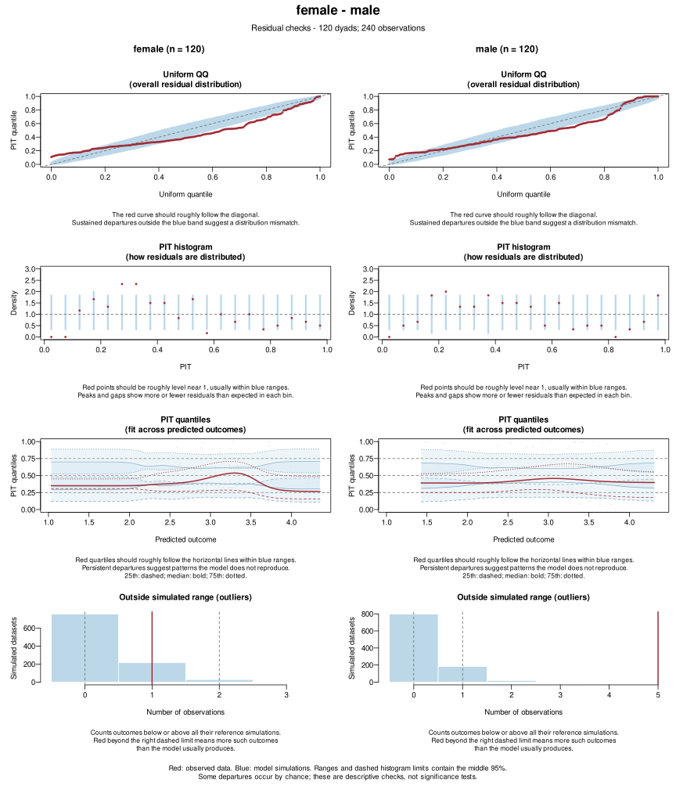
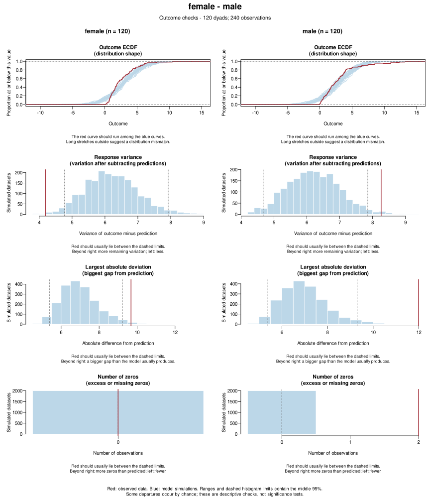
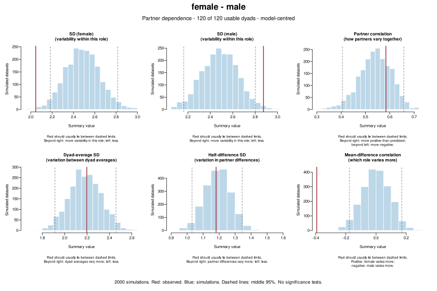

Does a fitted model reproduce the response distribution and how strongly
partners are related? `dyadMLM` compares these features in the observed
data with the same features in datasets simulated from the model.

The plots help locate mismatches and can be used to examine a simpler model when
a fuller model does not converge. To formally test a specific covariance
restriction, use a suitable model comparison, such as
[`compare_nested_models()`](https://pascal-kueng.github.io/dyadMLM/reference/compare_nested_models.html),
when both models can be fitted reliably.

```{r setup, include=FALSE}
devtools::load_all(file.path("..", ".."), quiet = TRUE)
knitr::opts_chunk$set(
  message = FALSE, fig.width = 10, fig.height = 6.5, out.width = "100%"
)
```

## Check a model

Fit an APIM for the female-male dyads that allows different effects and response
variances for women and men, but assumes no remaining correlation between
partners. Then simulate new responses from the model and compare their standard
deviations (SDs) and partner correlation with the observed ones.

```{r check, fig.alt="Female-male dyads: both role SDs lie within their simulated ranges, but the observed partner correlation lies above its range."}
data <- prepare_dyad_data(
  dyads_cross, dyad = coupleID, member = personID, role = gender,
  predictors = provided_support, model_types = "apim",
  keep_compositions = "female-male"
)
model <- glmmTMB::glmmTMB(
  closeness ~ gender * (.provided_support_actor + .provided_support_partner) +
    diag(0 + gender | coupleID),
  dispformula = ~0, family = gaussian(), data = data
)
simulations <- simulate_dyad_responses(model, seed = 123)
check <- check_partner_dependence(simulations, dyad = coupleID, role = gender)
```

The red line is the observed value; dashed lines mark the middle 95% of the
simulated values. Both role SDs lie within their ranges, but the observed partner
correlation lies above its range: the model misses how strongly partners are
related. The bottom row shows the same information through dyad averages and
partner differences. By default, the check first subtracts the model's fixed-effect
predictions, so it looks at the variation left after the fixed effects.

## Allow partner correlation

Replace the diagonal block with an unstructured block and check again.

```{r flexible-model, fig.alt="Female-male dyads: all summaries lie within their simulated ranges."}
flexible <- update(model, formula =
  closeness ~ gender * (.provided_support_actor + .provided_support_partner) +
    us(0 + gender | coupleID)
)
flexible_check <- check_partner_dependence(
  simulate_dyad_responses(flexible, seed = 123), dyad = coupleID, role = gender
)
```

The partner correlation now lies within its range. This agreement is expected: a
model usually reproduces what it estimates from the same data. The check is most
informative for features a model restricts, like the omitted correlation above.

## Check each dyad composition

`dyads_cross` also contains female-female and male-male dyads, 120 of each
composition. This model allows different mean closeness for women and men but
uses one exchangeable covariance for all 360 dyads.

```{r mixed-pooled, fig.alt="All 360 dyads checked together: all summaries lie within their simulated ranges."}
mixed_data <- prepare_dyad_data(
  dyads_cross, dyad = coupleID, member = personID,
  predictors = provided_support, model_types = "apim", seed = 123
)
pooled_model <- glmmTMB::glmmTMB(
  closeness ~ gender +
    us(1 | coupleID) +
    us(0 + .member_contrast_arbitrary | coupleID),
  dispformula = ~0, family = gaussian(), data = mixed_data
)
pooled_simulations <- simulate_dyad_responses(pooled_model, seed = 123)
check_partner_dependence(pooled_simulations, dyad = coupleID, role = NULL)
```

Checked together, all summaries agree, as expected: the model estimates exactly
these pooled summaries. Supplying `role` checks each composition with the same
simulations.

```{r mixed-compositions, fig.alt=c("Female-female dyads: all summaries lie within their simulated ranges.", "Female-male dyads: the observed female SD lies above its range.", "Male-male dyads: the observed SDs lie below their ranges.")}
check_partner_dependence(pooled_simulations, dyad = coupleID, role = gender)
```

The model underestimates female variability in female-male dyads and
overestimates variability in male-male dyads. A mismatch does not show its cause:
omitted predictors can produce it too. Here, adding support effects separately
for women and men brings every composition summary within its range, with the
same covariance structure:

```{r mixed-predictors}
support_model <- update(
  pooled_model,
  formula = . ~ . + gender:(.provided_support_actor + .provided_support_partner)
)
support_check <- check_partner_dependence(
  simulate_dyad_responses(support_model, seed = 123),
  dyad = coupleID, role = gender, plot = FALSE
)
```

## What the simulation studies show

- **Small samples miss mismatches.** In a Gaussian APIM, an omitted residual
  partner correlation of 0.30 was detected in 48% of datasets with 40 dyads and
  86% with 100. A correlation of 0.10 was detected in only 18% with 100 dyads.
- **Subtracting predictions helps.** Checks of raw outcomes detected less: 33%
  instead of 48% for a correlation of 0.30 with 40 dyads.
- **Flags also occur when the model is right.** Across 14 composition summaries,
  the checks flagged 23% of correctly pooled Gaussian datasets with 100 dyads;
  model comparison rejected 7%.
- **Checks and model comparison complement each other.** For Gaussian outcomes,
  the checks detected wrong pooling more often (43% vs 21% for an SD ratio of
  1.25 with 100 dyads). For other families with 400 dyads, model comparison did
  better once false alarms are counted. With 40 dyads, neither a flag nor
  agreement said much.

So treat a flag as a reason to investigate, and test a restriction with model
comparison when both models can be fitted. The
[partner-dependence study](https://pascal-kueng.github.io/dyadMLM/articles/partner-dependence-simulation.html)
and the
[covariance-pooling study](https://pascal-kueng.github.io/dyadMLM/articles/covariance-pooling.html)
report every family, sample size, and false-alarm rate.

## A model can reproduce correlation but miss other features

These simulated Tweedie outcomes are nonnegative and skewed, with some zeros
and different variability for women and men. We deliberately fit a Gaussian
model with the same effects and variance for both roles. Its shared dyad
intercept allows positive partner correlation; there is no member-difference
random effect, but observation-level variance is still estimated.

Read the saved dataset of 120 female-male dyads, fit the model, and simulate
once for all three checks. Supply the original fitting data because `role`
is not part of this model. The role labels split the plots; they do not change
the fitted assumptions.

```{r tweedie-gaussian-checks, eval=FALSE}
tweedie_data <- read.csv(
  "distribution-diagnostics/results/tweedie-gaussian/data.csv",
  colClasses = c(dyad = "factor", role = "factor")
)
gaussian_model <- glmmTMB::glmmTMB(
  outcome ~ predictor + (1 | dyad),
  family = gaussian(), dispformula = ~1, data = tweedie_data
)
gaussian_simulations <- simulate_dyad_responses(
  gaussian_model, nsim = 2000, seed = 100105
)
check_residuals(
  gaussian_simulations, dyad = dyad, role = role,
  data = tweedie_data, seed = 123, ask = FALSE
)
check_outcomes(
  gaussian_simulations, dyad = dyad, role = role,
  data = tweedie_data, check_zeros = TRUE, ask = FALSE
)
check_partner_dependence(
  gaussian_simulations, dyad = dyad, role = role,
  data = tweedie_data, ask = FALSE
)
```

**Residuals:** the QQ curves and PIT histogram reveal a distribution mismatch.
Five male outcomes fall outside all their reference simulations, compared with
a usual simulated count of zero to one. In the quantile plot, *predicted
outcome* means the model prediction with random effects set to zero, not the
observed outcome. Red quartiles should roughly follow the horizontal lines
at 0.25, 0.50 and 0.75 and usually remain within their blue bands.



**Outcomes:** the Gaussian model generates negative values, misses the male
zeros, and understates the largest deviations from predictions. The common
variance is too large for female responses and too small for male responses.



**Partner dependence:** the role SDs and mean–difference correlation reveal
the unequal variability, while the partner correlation agrees reasonably
well. Omitting the difference random effect does not by itself force a
mismatch: the shared intercept and observation-level noise can reproduce
positive partner correlation.



Several assumptions are wrong here, so a failed check does not identify a
single cause. Blue ranges describe the middle 95% of simulated results at
each comparison, not across all plots; these are descriptive checks, not
significance tests. The [full seven-page example](distribution-diagnostics/results/tweedie-gaussian/index.html)
adds predictor checks and other views. Its [reproduction script](distribution-diagnostics/tweedie-gaussian.R)
also generates the dataset.

## Other options

- `response = "raw"` compares responses without subtracting predictions.
- `role = NULL` treats partners as interchangeable: the check then reports a
  common SD and a partner correlation that do not depend on member order.
- `panels = FALSE` draws each summary separately, and `plot(check)` redraws a
  saved check without new simulations.
- For ordinal outcomes, the check compares category scores 1, 2, and so on.
  Zero-inflated and hurdle checks use the combined outcome, including zeros.

The checks support unweighted, cross-sectional models. See
`?check_partner_dependence` and `?simulate_dyad_responses` for supported
families, output, and details.
